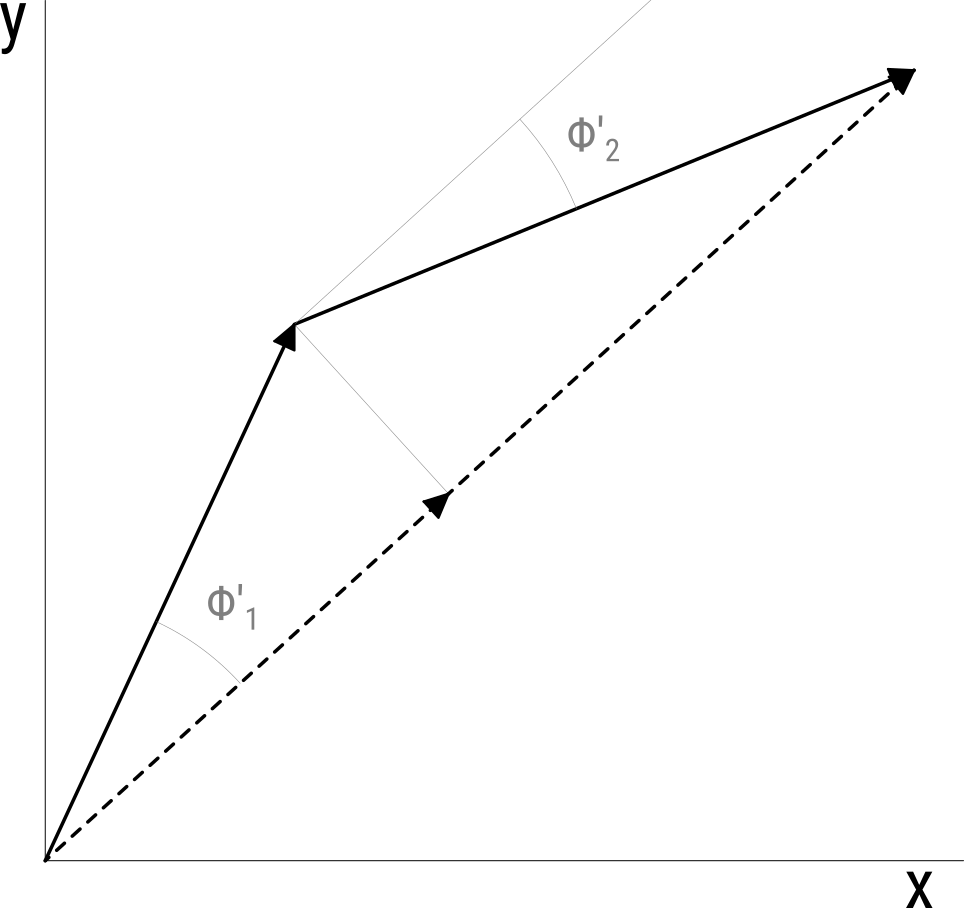

```{r setup, include=FALSE}
# Notification
start.time <- unclass(Sys.time())
min.time <- 10
knit_doc <- knitr::knit_hooks$get("document")
knitr::knit_hooks$set(document = function(x) {
   took <- unclass(Sys.time()) - start.time
   if (unclass(Sys.time()) - start.time >= min.time) {
      notify("Done knitting!", 
             paste0("Took ", round(took), " seconds"),
             time = 5)
   }  
   knit_doc(x)
})

name <- tools::file_path_sans_ext(knitr::current_input())
knitr::opts_chunk$set(echo = FALSE,
                      cache = TRUE,
                      warning = FALSE, message = FALSE,
                      out.extra = "", 
                      cache.path = paste0("cache/", name, "/"),
                      fig.path = paste0("fig/", name, "/"))

library(metR)
library(data.table)
library(ggplot2)
library(metR)
library(magrittr)
library(circular)
library(RcppRoll)
library(patchwork)
library(lubridate)

source("scripts/helperfun.R")

data.world <- BuildMap(res = 1, smooth = 1)
map.world <- geom_map2(data.world)
map.SH <- geom_map2(data.world[lat %b% c(-90, 20)], color = "gray20")

lev.breaks <- c(1000, 500, 300, 200, 100, 50, 10)

theme_elio <- theme_minimal(base_size = 11) +
   theme(
      # text = element_text(family = font_rc),
      legend.position = "bottom", legend.box = "vertical",
      panel.spacing.y = unit(5, "mm"),
      panel.spacing.x = unit(5, "mm"),
      legend.spacing = unit(2, "mm"),
      plot.margin = grid::unit(rep(3, 4), "mm"),
      legend.title = element_blank(),
      legend.box.spacing = unit(3, "mm"),
      legend.margin = margin(t = -5),
      panel.grid = element_line(color = "gray50", size = 0.2, linetype = 3),
      panel.ontop = TRUE)
theme_set(theme_elio)
guide_colorstrip_bottom <- function(width = 25, height = 0.5, ...) {
   guide_colorstrip(title.position = "top", title.hjust = 0.5,
                    barheight = height,
                    barwidth = width, ...)
}

```

```{r read-data}
ncep <- ReadNetCDF("DATA/NCEP Reanalysis/hgt.mon.mean.nc", c(gh = "hgt"), 
                   subset = list(lat = -90:0, 
                                 time= c("1979-12-01",
                                         "2015-12-01")))
setnames(ncep, "level", "lev")
```

# Concepto básico

Antes de poder tener una medida de la *estacionariedad* de un conjunto de ondas tengo que entender qué quiero decir con ondas estacionarias. 

Primero, la estacionariedad no es una propiedad de una onda sino de un conjunto de ondas. Para ser más preciso, la estacionariedad es la propiedad de la *población* de ondas generadas a partir de un proceso (físico o estadíco) y lo que se busca es estimarla a partir de las propieda des de una *muestra* de ondas. 

Segundo, un conjunto de ondas perfectamente estacionario tiene fase constante, mientras que la amplitud puede variar como quiera. Es decir, la estacionariedad es describe la variabilidad en la localización de máximos y mínimos pero no su intensidad. Sin embargo, esta propiedad no sirve para definir estacionariedad de forma continua (estacionariedad en mayor o menor grado). Una onda con una fase completamente aleatoria pero con amplitud mayor cuando se da en una fase preferencial (fase estacionaria) *es* estacionaria. De ahí que en estacionariedad no sólo está involucrada la distribución de la fase sino también la relación entre ésta y la amplitud.

La estacionariedad, entonces, involucra dos efectos: la distribución de la fase (estacionariedad de fase) y la relación entre la amplitud y la fase (estacionariedad de amplitud). Un conjunto de ondas puede ser estacionario por tener la mayoría de sus elementos con fase similar a la fase estacionaria y una amplitud constante o aleatoria, o puede serlo teniendo una fase aleatoria pero una mayor amplitud cuando la fase está cerca de la fase estacionaria. El primer efecto se puede observar en la distribución de densidad de la fase mientras que el segundo se aprecia en la amplitud media en función de la fase.  

```{r calc-density}
qs <- ncep[, FitWave(gh, 3), by = .(lat, time, lev)] 
qs[, phase.c := circular(phase*3, modulo = "2pi")]
lats <- c(-55, -10)
qs.density <- qs[lat != -90 & lev == 200,
                 density(phase*3*180/pi, weights = amplitude/sum(amplitude),
                         from = 0, to = 360)[c("x", "y")],
                 by = lat]
mean.phases <- qs[lat %in% lats & lev == 200,
                  .(mean.phase = mean.wave(amplitude, phase, k)$phase*180/pi*3),
                  by = lat]
# qs.density <- qs[lat != -90, 
#                  density(phase.c, bw = 7)[c("x", "y")], 
#                  by = lat] 
```

```{r densities, fig.cap = "Estimated density of wave 3 phase weighted by amplitude in 45°S (red) and 10°S (blue) at 500hPa. Vertical lines show the stationary phase, which is identical to the mean phase weighet by amplitude.", fig.height=3}
ggplot(qs.density[lat %in% c(-10, -55)], 
       aes(x, y, color = factor(lat))) + 
   geom_line() +
   geom_vline(aes(xintercept = mean.phase, color = factor(lat)),
              data = mean.phases, linetype = 2) +
   # geom_rug(data = mean.phase, aes(x = mean.phase, y = 0)) +
   scale_y_continuous("Density") +
   scale_x_continuous("Phase", seq(0, 360, by = 60),
                      label = AddSuffix("°")) +
   scale_color_brewer("Latitude", palette = "Set1",
                      label = LatLabel) +
   theme(legend.title = element_text())
```

Una forma de combinar ambos efectos y visualizar la estacionariedad es la distribución de la fase pesada por la amplitud. Esto se ve en la Figura \ref{fig:densities} que muestra la distribución de probabilidad de la fase pesada por la amplitud para dos latitudes distintas. Queda claro que la onda 3 es más estacionaria en 10°S que en 45°S. En este caso tanto la estacionariedad de fase como la de amplitud es mayor en 10°S que en 45°S.

Notar que en estos casos las distriuciones son claramente unimodales. En el caso de ser multimodal, se podría definir la estacionariedad con respecto a cada moda. En cualquier caso, queda claro que la estacionariedad se define con refernecia a una determinada fase estacionaria. Las líneas verticales marcan la fase de la onda promedio para cada latitud (que es idéntica a la media de la fase pesado por la amplitud) que es la fase estacionaria considerada. Se puede observar que este valor no coincide exactamente con la moda de la distribución. 

# Posibles medidas

## Varianza de la fase

Una forma intuitiva de medir la estacionariedad podría ser la variabilidad en la fase con respecto a la fase estacionaria. Una onda perfectamente estacionaria debería tener nula variabilidad en la fase mientras que una onda totalmente "antiestacionaria" tendría una varianza igual a la de una distribución uniforme entre $0$ y $2\pi$ ($(2\pi)^2/12 \sim 3.29$).

De la discusión anterior se desprende que esta medida puede representar la estacionariedad de fase, pero no la estacionariedad de amplitud.

## Correlación entre fase y amplitud

Para capturar la estacionariedad de amplitud podría considerarse la correlación entre la amplitud de las ondas y el corrimiento de fase con respecto a la fase estacionaria. Cuanto más negativa, más estacionaria. 

El problema es que esta medida no represetna la estacionariedad de fase. Además no queda claro cómo interpretar las correlaciones positivas. 

## Varianza de la fase pesada por la amplitud

Una forma de combinar ambos tipos de estacionariedad es calcular la varianza de la fase pero pesarla por la magnitud de la amplitud (AVAR). Ondas que se alejan mucho de la fase estacionaria pero tienen poca amplitud contriburían poco a esta medida, capturando el efecto de estacionariedad de amplitud. Esta medida equivale a la varianza de la función de densidad pesada por la amplitud (Figura \ref{fig:densities}).

Un detalle a tener en cuenta es que la fase es una variable circular con período $2\pi$, lo que significa que $0 - 2\pi = 0$ y así es como hay que interpretar las distancias. Una forma de calcular esta distancia correctamente es definir la resta como el arcoseno del coseno de la resta. 

AVAR se define, entonces como

$$
\mathrm{AVAR} =\frac{1}{N'} \sum_{i = 1}^{N'} \frac{A_i}{A_e}\cos^{-1}  \left[ \cos \left( \overline{\phi} - \phi_i \right) \right]^2
$$

donde $N'$ es la cantidad de elementos con $A_i \ne 0$, $A_i$ y $\phi_i$ son la amplitud y la fase de la *i*ésima onda, $A_e = \sum_{i = 1}^{N'}A_i$ es la sumatoria de las amplitudes (que equivale a la amplitud de la suma de ondas en el caso 100% estacionario) y $\overline{\phi}$ es la fase estacionaria (entendida como al fase de la onda media).


## AMOMA

Otra forma de pensar en la estacionariedad de las ondas es considerando el efecto de la interferencia destructiva. En un conjunto de ondas estacinario, la suma de las ondas es siempre constructiva, mientras que en uno no estacionario, hay la misma cantidad de interferencia constructiva y destructiva. Una forma de medir este efecto es comparando la amplitud de la onda media (AM) que sufre el efecto de la interferencia destructiva y la media de la amplitud de las ondas (MA), que no tiene en cuenta éste efecto.

Intuitivamente, la amplitud de la onda media debería ser 0 para un grupo de ondas no estacionarias e igual a la amplitud media en un grupo de ondas perfectamente estacionarias. De modo que *AMMOMA* (AM over MA) tomaría valores entre 0 y 1 indicando el nivel de estacionariedad del conjunto de ondas. 

Formalizando matemáticamente, si la amplitud de una onda $w_i$ es $A(w_i)$, se tiene que 

$$
\begin{aligned}
\mathrm{AM} &=& A(\overline{w_i}) &=& A \left ( \frac{1}{N}\sum_{i=1}^{N}w_i\right) \\
\mathrm{MA} &=& \overline{A(w_i)} &=& \frac{1}{N}\sum_{i=1}^{N}A(w_i) 
\end{aligned}
$$

La segunda expresión no tiene demasiada complicación, pero la primera hay que desarrollarla. 

Suponiendo el caso $N = 2$, se tiene que 

$$
w_1  = A_1\cos(k(\phi - \alpha_1)) \quad
w_2 = A_2\cos(k(\phi - \alpha_2)) 
$$

La suma de las ondas será una tecer onda con igual período pero distinta amplitud y fase. [Se puede demostrar](http://scipp.ucsc.edu/~haber/ph5B/addsine.pdf) que la amplitud $A_3$ de dicha suma es 

$$A(w_1 + w_2) = A_3 = \sqrt{A_1^2 + A_2^2 + 2A_1A_2\cos(\alpha_1 - \alpha_2)}$$

En el caso de ondas perfectamente estacionarias se tiene que $\alpha_1 = \alpha_2 = \alpha_i = \alpha_0$ (o equivalentemente, $\alpha_i \ne \alpha_0 \rightarrow  A_i = 0$) de manera que $A_3 = A_1 + A_2$ y generalizando a la suma en $N$, se llega a que

$$
\begin{aligned}
A \left ( \frac{1}{N}\sum_{i=1}^{N}w_i\right)  &=  \frac{1}{N}\sum_{i=1}^{N}A(w_i) \\
\mathrm{AM}& = \mathrm{MA}
\end{aligned}
$$

Es decir, para ondas perfectamente estacionarias, $AM/MA = 1$. 

Para ondas no estacionarias... todavía no encontré el formalismo de matemática pura, pero se puede ver "empíricamente". Para distintos valores de $N$, calculo la amplitud de la suma de $N$ ondas con amplitud constante (2, en este caso) y fase aleatoria ($\alpha \sim U(0, 2\pi)$). Repito eso 1000 veces y calculo el promedio. Esto me da una estimación de la esperanza matemática de AM para distintos tamaños muestrales.

```{r calc-sim, include=FALSE}
sim_stationarity <- function(n, d = 0, trans = TRUE) {
   x <- rnorm(n) + d
   y <- rnorm(n)
   am <- sqrt(x^2 + y^2)
   phase <- atan2(y, x)
   if (isTRUE(trans)) {
      2/pi*asin(weighted.mean(cos(phase - mean.phase(am, phase, 1)), am))
   } else {
      weighted.mean(cos(phase - mean.phase(am, phase, 1)), am)
   }
}

B <- 1000
trials <- data.table(expand.grid(n = seq(2, 500, by = 10),
                                 trans = c(TRUE, FALSE)))
set.seed(42)
trials[, S := mean(sapply(1:B, function(x) sim_stationarity(n, trans = trans))),
       by = .(trans, n)]


trials[, mean(S*sqrt(n), na.rm = TRUE)] -> k
```

```{r sim, echo=FALSE, fig.cap=" Amplitud del promedio de N ondas con amplitud = 2. La línea roja es la línea $y = x^{1/2}$.", out.extra = "", fig.height=3}
ggplot(trials, aes(n, S)) +
   geom_point(size = 1.3, aes(color = trans)) +
   stat_function(fun = function(x) sqrt(1/x), color = "red") +
   scale_color_brewer(palette = "Set1", labels = c("TRUE" = "2/pi*asin(AMOMA)",
                                                   "FALSE" = "AMOMA")) +
   scale_y_continuous("Amplitud") +
   scale_x_continuous("N") 
```

Se puede ver en la Figura \ref{fig:sim} que $\lim_{N\rightarrow \infty} \mathrm{AM}= 0$ y que va como $\sim N^{-1/2}$ aunque con una constante multiplicativa que en este caso es $k = `r round(k, 3)`$. La parte más empírica y sucia viene ahora, porque *jugando* con este y otros casos, parece ser que que esa contante es $k = \frac{A}{2}\sqrt{\frac{\pi}{N}}$. De manera que, *empíricamente* se puede ver que en el caso de ondas con fase totalmente aleatorias 

$$
\mathrm{AM} = \mathrm{MA} \ \mathrm{N}^{1/2}
$$

Cabe notar que esta igualdad vale para el promedio de MA, no para mediciones individuales. En @Pain2005 se demuestra que la amplitud suma de $N$ ondas con igual amplitud $A$ y fase aleatoria es $\sqrt{N}A$. Es to justifica el factor $1/\sqrt{N}$, pero no se ve por qué aparece $\sqrt{\pi/2}$.

Poniendo todo en limpio, se demostró (con una mezcla de teoría y práctica), que si se define $\mathrm{AMOMA} = \frac{\mathrm{AM}}{\mathrm{MA}}$ como medida de estacionariedad, se tiene que 

$$
\sqrt{\frac{1}{N}} \le \mathrm{AMOMA} \le 1
$$

y que las igualdades izquierda y derecha valen para el caso de pura inestacionariedad y pura estacionariedad respectivamente. 

Se puede llegar a otra forma de expresar AMOMA que clarifica su significado. Sea 

$$
\mathrm{\overline{A}}^2 + \mathrm{A}_i^2 + 2\mathrm{\overline{A}}\mathrm{A}_i\cos\left (\overline{\phi} - \phi_i \right ) = \mathrm{\tilde{A}}_i^2 
$$

Donde $\mathrm{\overline{A}}$ es la amplitud de la onda media, $\mathrm{A}_i$ es la amplitud de la *i*ésima onda, $\overline{\phi}$ es la fase de la onda media, $\phi_i$ es la fase de la onda *i*ésima y $\mathrm{\tilde{A}}_i$ es la amplitud resultante de la suma de onda media y la *i*ésima onda. 

Reordenando y dividiendo por $A_e$ se obtiene

$$
\frac{\mathrm{A}_i}{\mathrm{A}_e}\cos\left (\overline{\phi} - \phi_i \right ) = \frac{\mathrm{\tilde{A}}_i^2 - \left( \mathrm{\overline{A}}^2+\mathrm{A}_i^2 \right)}{2\mathrm{\overline{A}}\mathrm{A}_e}
$$

Haciendo la suma en $i$ y dividiendo por $N'$ se obtiene

$$
\frac{1}{N'}\sum_{i=1}^{N'}\frac{\mathrm{A}_i}{\mathrm{A}_e}\cos\left (\overline{\phi} - \phi_i \right ) = 
\sum_{i=1}^{N'}\frac{\mathrm{\tilde{A}}_i^2 - \mathrm{\tilde{A}}_{ie}^2  }{2N'\mathrm{\overline{A}}\mathrm{A}_e}
$$

Donde además se escribió $\mathrm{\tilde{A}}_{ie}^2 =  \mathrm{\overline{A}}^2+\mathrm{A}_i^2$, que es el cuadrado de la amplitud de la suma entre la onda *i*ésima y la onda media si ésta fuera perfectmaente estacionaria. 

Teniendo en cuenta que $\rho_{w_i} = \cos(\overline{\phi}- \phi_i)$ es la correlación entre la onda media y la *i*ésima onda ([demostración](https://www.johndcook.com/blog/2016/03/06/correlating-two-sine-waves/)), la expresión de la izquierda es el promedio pesado de la correlación entre las ondas y la onda media. Este valor es igual a AMOMA (demostración pendiente, pero se vio numéricamente).

La expresión de la derecha es la sumatoria de la diferencia entre el cuadrado de la suma de la amplitud y la suma de la ampitud en el caso estacionario, normalizada por el producto de la amplitud de la suma estacionaria y la amplitud media (hay un factor $1/2$ que no es muy relevante). 

De esto surge que AMOMA es proporcional a la suma de las diferencias entre amplitudes reales y las amplitudes que se obtendrían en el caso perfectamente estacionario. 

Como nota metodológica, es computacionalmente más eficiente y además más exacto computar AMOMA como el promedio pesado del coseno de la diferencia de fase que como la amplitud de la onda promedio sobre el promedio del a amplitud. 

Comparando ambas medidas, se puede notar su similaridad

$$
\begin{aligned}
\mathrm{AMOMA} &= \frac{1}{N'}\sum_{i=1}^{N'}\frac{\mathrm{A}_i}{\mathrm{A}_e}\cos\left (\overline{\phi} - \phi_i \right ) \\
\mathrm{AVAR} &=\frac{1}{N'} \sum_{i = 1}^{N'} \frac{A_i}{A_e}\cos^{-1}  \left[ \cos \left( \overline{\phi} - \phi_i \right) \right]^2
\end{aligned}
$$

Ambos son el promedio pesado de una distancia entre la fase y la fase estacionaria. Pero ésta se define de manera distinta.

## Demostración gráfica

```{r demostracion, fig.cap = " ", out.width="200mm", out.height="50mm", fig.align="center"}

```


La igualdad entre AM/MA y la suma ponderada de cosenos se puede demostrar mirando la Figura \ref{fig:demostracion}. Llevando al caso simplificado de sólo dos vectores, puede verse que la magnitud total del vector suma puede descomponerse en las contribuciones de cada vector individual. Ésta contribución no es más que la proyección del vector individual sobre el vector suma, es decir:

$$
A_{1+2} = A_1\cos(\phi_{1+2} - \phi_1) + A_2\cos(\phi_{1+2} - \phi_2)
$$


## Escalado 

@Singer1967 desarrolla una variable llamada *steadniess* definida como $2\sin^{-1}(\mathrm{AMOMA})/\pi$. La fustificación de esta función de escalado es que linearliza el comportamiento de AMOMA en relación al rango de variabilidad. 

```{r calc-avar}
qs[, phase.stat := mean.wave(amplitude, phase, k)$phase, by = .(lat, lev, season(time))]
qs[, phase.stat.c := circular(phase.stat*3, modulo = "2pi")]

avar <- qs[amplitude != 0, 
           .(avar = (mean(amplitude/sum(amplitude)*acos(cos(3*(phase - phase.stat)))^2))),
           by = .(lat, lev, season(time))]
```

```{r calc-amoma}
meanfun <- function(x, group, fun, ...) {
   dt <- data.table(x, group)
   dt[, group2 := seq_len(.N), by = group]
   
   mf <- dt[, .(f = fun(x, ...)), by = group][, .(mf = mean(f, na.rm = TRUE))]$mf
   fm <- dt[, .(m = mean(x, na.rm = TRUE)), by = group2][, .(fm = fun(m, ...))]$fm
   
   return(list(mean.fun = mf, fun.mean = fm))
}

amoma <- ncep[ , meanfun(gh, time, function(x) FitWave(x, 3)$amplitude),
               by = .(lat, lev, season(time))] %>% 
   .[, amoma := fun.mean/mean.fun]
```

```{r amoma-avar, fig.cap = "Relationship between AVAR and AMOMA.", fig.height=3}
avar[amoma, on = c("lat", "lev", "season")] %>% 
   ggplot(aes(amoma, avar)) +
   geom_point(size = 0.5, alpha = 0.2) +
   scale_x_continuous("AMOMA") +
   scale_y_continuous("AVAR") +
   avar[amoma, on = c("lat", "lev", "season")] %>% 
   ggplot(aes(asin(amoma)*2/pi, sqrt(avar))) +
   geom_point(size = 0.5, alpha = 0.2) +
   scale_x_continuous("asin(AMOMA)*2/pi") +
   scale_y_continuous("sqrt(AVAR)") 
```

En efecto, en la Figura \ref{fig:amoma-avar} puede observarse como la relación entre AMOMA y AVAR es ligeramente no lineal, mientras que la relación entre *steadiness* y la raiz de AVAR (que representaría el desvío estándar) es mucho más lineal y con menos spread. También, como se ve en la Figura \ref{fig:amoma-densities}, la distribución de *steadiness* es menos asimétrica y más normal que de AMOMA. 

```{r amoma-densities, fig.cap = "Estimated probability densities of AMOMA (red) and steadiness (blue)., fig.height = 3"}
amoma[, .(amoma = amoma)] %>% 
   .[, steadiness := asin(amoma)*2/pi] %>% 
   melt(variable.name = "method", value.name = "amoma") %>% 
   ggplot(aes(amoma)) +
   geom_density(aes(color = method, fill = method), alpha = 0.25, trim = TRUE) +
   scale_color_brewer(palette = "Set1", aesthetics = c("color", "fill"))
```

Como esta transformación la encontré después de hacer el análisis de abajo, por ahora uso AMOMA. Sin embargo, creo que usar el *steadiness* parece mejor. De todass formas, las conclusiones generales valen para ambas medidas. 

# Algunos resultados

## Campos espaciales

```{r amoma-avar-field, fig.cap = "AMOMA (shaded) and AVAR (contours)", fig.height=4}
ggplot(amoma, aes(lat, lev)) +
   geom_contour_fill(aes(z = avar), data = avar) +
   geom_contour_tanaka(aes(z = amoma)) +
   scale_x_latitude(trans = "reverse", ticks = 15)+
   scale_fill_viridis_c(direction = -1) +
   scale_y_level(breaks = lev.breaks) +
   facet_wrap(~season)
```

La comparación ente AMOMA y AVAR (Figuras \ref{fig:amoma-avar} y \ref{fig:amoma-avar-field}) muestran que hay un excelente acuerdo entre ambas medidas. En latitudes medias, la máxima estacionariedad se da en 45°S y 500hPa, teniendo un mínmo en primavera. Se observa el alto nivel de estacionariedad en los niveles altos de las latitudes tropicales, especialmente en verano, probablemente debido a la atividad del SAMS. 


## Evolución temporal 

La estacionariedad no puede estar definida para un mes en particular sino que sólo se define con respecto a una fase estacionaria que debe ser calculada para un determinado intervalo de tiempo. Lo más directo es usar todo el período, pero si interesa saber el nivel de estacionariedad en una década determinada, por ejemplo, se debe usar la fase estacionaria de esa década. 

```{r read-more}
ncep <- ReadNetCDF("DATA/NCEP Reanalysis/hgt.mon.mean.nc", c(gh = "hgt"),
                   subset = list(lat = -90:0))
setnames(ncep, "level", "lev")
qs <- ncep[, FitWave(gh, 3), by = .(time, lev, lat)]
remove(ncep)
```


```{r calc-ts}
w <- 12*5 + 1 

S <- copy(qs) %>% 
   .[, amoma := listapply(as.wave(amplitude, phase, k),
                          w, stationarity.wave2), 
     by = .(lat, lev)] %>% 
   .[, .(lat, lev, time, amoma)]
```


```{r ts, fig.cap = "Stationarity as meassured by AMOMA at 45°S and 500hPa. The pre-satellite era is marked in gray.", fig.height=3}
S[lat == -45 & lev == 500 & !is.na(amoma)] %>%
   ggplot(aes(time, amoma)) +
   geom_rect(xmin = -Inf, xmax = as_datetime("1980-01-01"), 
             ymin = -Inf, ymax = Inf,
             alpha = 0.5, fill = "gray90") +
   geom_line()  +
   scale_y_continuous("Stationarity")  +
   scale_x_datetime(expand = c(0, 0), date_breaks = "5 years", 
                    date_labels = "%y")
```

La Figura \ref{fig:ts} muestra la serie temporal de estacionariedad con una ventana móvil de 5 años. La variación interanual es evidente, con momentos alternados de baja (p.ej. 1975-80) y alta (p.ej. 1980-90) estacionarieda. Los datos previos a la era satelital (región gris) son menos confiables. Idealmente habría que confirmarlo con otros reanálisis. 

Una forma alternativa --aunque conceptualmente equivalente-- de obtener una serie temporal, es la de calcular la medida de distancia para cada mes y luego ajustar un modelo LOWESS usando la amplitud como los pesos. El resultado de este método (Figuras \ref{fig:cor-smooth} y \ref{fig:cor-smooth-corte}) tiene menor varianza en la alta frecuencia pero captura las variaciones temporales de más baja frecuencia correctamente. 

```{r calc-amoma-loess}
window <- 5
qs[, c("R", "I") := .(amplitude*cos(3*phase), amplitude*sin(3*phase))]
qs[, R.s := smooth.loess(R ~ as.numeric(time), span = 365*window/.N), 
   by = .(lev, lat)]
qs[, I.s := smooth.loess(I ~ as.numeric(time), span = 365*window/.N),
   by = .(lev, lat)]

# qs[, phi.s := mean.phase(amplitude, phase, 3), by = .(lev, lat)]
qs[, rho := cos(3*phase - phi.s)]

qs <- qs[!is.na(rho) & lat != -90,
         c("amoma", "ci") := 
            predict(loess(rho ~ as.numeric(time), weights = amplitude, 
                          span = 0.13, data = .SD, degree = 1), 
                    se = TRUE)[c("fit", "se.fit")],
         by = .(lev, lat)]

```


```{r cor-smooth, fig.cap = "Correlation between monthly wave and the mean wave, lowess fit weigthed by wave amplitude (black line) and 95\\% confidence interval. AMOMA computed with a 5 year running window is shown (in red) as reference. All in 45°S and 500hPa", fig.height=3}
ggplot(qs[!is.na(rho) & lev == 500 & lat == -45], aes(time, rho)) +
   geom_rect(xmin = -Inf, xmax = as_datetime("1980-01-01"),
             ymin = -Inf, ymax = Inf,
             alpha = 0.5, fill = "gray90") +
   geom_line(color = "gray") +
   geom_line(aes(y = amoma), data = S[lev == 500 & lat == -45],
             color = "red") +
   geom_ribbon(aes(ymin = amoma - 2*ci, ymax = amoma + 2*ci),
               fill = "gray20", alpha = 0.2) +
   geom_line(aes(y = amoma)) +
   # geom_smooth(aes(weight = amplitude), span = 0.13,
               # method.args = list(degree = 1)) +
   # scale_y_continuous(trans = "atanh") +
   # coord_trans(y = "tanh") +
   coord_cartesian(ylim = c(0.0, NA)) +
   scale_x_datetime(expand = c(0, 0), date_breaks = "5 years", 
                    date_labels = "%y")
```

```{r cor-smooth-corte, fig.cap = "Hovmoller plot of AMOMA stationarity a 500hPa computed as a lowess fit (contour) and as a rolling mean (shaded).", fig.height=4}
binwidth <- 0.05
qs[lev == 500] %>%
   # S[lev == 500] %>% 
   ggplot( aes(lat, time)) +
   geom_contour_fill(aes(z = amoma)) +
   # geom_rect(ymin = -Inf, ymax = as_datetime("1980-01-01"), 
   #           xmin = -Inf, xmax = Inf,
   #           alpha = 0.01, fill = "white") +
   geom_contour_tanaka(aes(z = amoma)) +
   scale_x_latitude(trans = "reverse") +
   scale_y_datetime(expand = c(0, 0), date_breaks = "5 years", 
                    date_labels = "%Y") +
   scale_fill_viridis_c() 
```

En el hovmoller de la Figura \ref{fig:cor-smooth-corte} puede observarse la evolución de la estacionariedad en 500hPa para cada círculo de latitud. ....


```{r calc-wavelets}
set.seed(42)
rbindlist(list(loess = qs[, .(lat, lev, time, amoma)],
               runmean = S), idcol = "method", use.names = TRUE) %>% 
   .[lev == 500 & lat == -45 & is.finite(amoma)] %>% 
   .[, date := time] %>% 
   {
      wavelets <<- .[, as.data.table(Wavelets(.SD, "amoma", dt = 1/12,
                                              loess.span = 0, 
                                              n.sim = 200)), 
                     by = .(method)] %>% 
         setnames("date", "time") 
      
      coi <<- .[, get_coi(Wavelets(.SD, "amoma", dt = 1/12,
                                   loess.span = 0, 
                                   n.sim = 1)), 
                by = .(method)] %>% 
         setnames("date", "time") 
   }
```


```{r amoma-wavelets, fig.cap = "Wavelet analysis for AMOMA stationarity at 45°S and 500hPa. a) Power spectrum (black lines show p.values lower than 0.01) and b) mean power spectrum for the whole period."}
ggplot(wavelets, aes(time, period)) +
   geom_contour_fill(aes(z = power)) +
   geom_contour_tanaka(aes(z = power)) +
   geom_contour(aes(z = p.value), breaks = 0.01, color = "black", 
                size = 0.3) +
   geom_coi(coi) +
   scale_fill_viridis_c() +
   scale_y_continuous(trans = "log2") +
   coord_cartesian(ylim = c(4, max(wavelets$period)), expand = FALSE) +
   facet_wrap(~method, ncol = 1) +
wavelets[, .(power = mean(power), p.value = mean(p.value)),
            by = .(period, method)] %>% 
   ggplot(aes(period, power)) +
   geom_line() +
   # geom_vline(xintercept = 16/(2^seq(0, 6)), linetype = 3) +
   scale_color_brewer(palette = "Set1") +
   scale_x_continuous(trans = "log2", breaks = log2_breaks)  +
   coord_flip(xlim = c(4, max(wavelets$period)), expand = FALSE) +
   facet_wrap(~method, ncol = 1, labeller = labeller(method = c(loess = " ",
                                                                runmean = " "))) +
   theme(axis.title.y = element_blank()) +
   plot_annotation(tag_level = "a")
```

La variabilidad interanual observada en la Figura \ref{fig:cor-smooth} se cuantifica mediante un análisis de wavelets en la Figura \ref{fig:amoma-wavelets}. La estacionariedad derivada a partir de ambos métodos da un resultado consistente. Puede observarse una fuerte periodicidad de entre 10 y 20 añosqueque es máxima en la segunda mitad del perídodo.

Una limitación de todo esto es que la periodicidad es relativamente larga en comparación con el período con datos confiables. 

## Regresiones

Para realizar regresiones se tomó como indicador de estacionariedad, el valor de AMOMA obtenido a partir del ajuste LOWESS en 45°S y 500hPa con la tendencia lineal eliminada. A su vez, se aplicó el mismo suavizado a las series de anomalías mensuales de SST, altura geopotencial y función corriente.

```{r rename}
S <- qs[, .(time, lat, lev, value = amoma)]
```

```{r read-ncep2}
ncep <- ReadNetCDF("DATA/NCEP Reanalysis/hgt.mon.mean.nc", c(gh = "hgt"),
                   subset = list(lat = -90:15, level = 500)) %>% 
   setnames("level", "lev")
```

```{r reas-sst}
sst <- ReadNetCDF("DATA/sst.nc", vars = "sst")[!is.na(sst)]

sst[, sst.a := Anomaly(sst), by = .(lon, lat, month(time))]
sst[, sst.a := predict(loess(sst.a ~ as.numeric(time), 
                             span = 0.13, data = .SD, degree = 1)),
    by = .(lat, lon)]

regr.sst <- S[lat == -45 & lev == 500, 
              .(time, value = Detrend(value))] %>% 
   .[sst, on = c("time"), allow.cartesian = TRUE] %>% 
   .[!is.na(value), FitLm(sst.a, value, se = TRUE), 
     by = .(lon, lat)]

regr.gh <- S[lat == -45 & lev == 500, .(time, value = Detrend(value))] %>% 
   ncep[lev == 500][., on = c("time"), allow.cartesian = TRUE] %>% 
   .[, gh := Anomaly(gh), by = .(lat, lon, month(time))] %>% 
   .[, gh := predict(loess(gh ~ as.numeric(time), span = 0.13, data = .SD, 
                           degree = 1)),
     by = .(lat, lon)] %>% 
   .[, FitLm(gh, value, se = TRUE), 
     by = .(lat, lon)]

stream <- ReadNetCDF("DATA/NCEP Reanalysis/psi.mon.mean.nc",
                     subset = list(level = 0.2101, 
                                   lat = -90:30, 
                                   time = lubridate::as_datetime(c("1979-12-01","2015-12-01")))) %>% 
   setnames("level", "lev")

stream[, psi.a := Anomaly(psi), by = .(lon, lat, month(time))]

regr.stream <- S[lat == -45 & lev == 500, 
                 .(time, value = Detrend(value))] %>% 
   .[stream, on = c("time"), allow.cartesian = TRUE] %>% 
   .[, psi.a := predict(loess(psi.a ~ as.numeric(time), span = 0.13, data = .SD, 
                              degree = 1)),
     by = .(lat, lon)] %>% 
   .[!is.na(value), FitLm(psi.a, value, se = TRUE), 
     by = .(lon, lat)]

regr.stream[, psi.z := estimate] %>% 
   .[, c("f.x", "f.y") := WaveFlux(.SD), by = .(term)]
```

```{r regr, fig.cap = "Regression of Sea Surface Temperature (shaded), 500hPa geopotential height (contours) with stationarity at 45°S 500hPa and activity wave fluxes derived from the regression of streamfunction with stationarity.", fig.height=5}
ggplot(regr.gh[term == "value"], aes(lon, lat)) +
   geom_raster(aes(fill = estimate), interpolate = TRUE,
               data = regr.sst[term == "value"]) + 
   geom_contour2(aes(z = estimate, linetype = factor(-sign(stat(level)))), 
                 breaks = AnchorBreaks(0, 20, 0), size = 0.2, xwrap = c(0, 360)) +
   geom_text_contour(aes(z = estimate), stroke.color = "white", stroke = 0.2,
                     breaks = AnchorBreaks(0, 20, 0), size = 2) +
   geom_streamline(aes(dx = f.x, dy = f.y), min.L = 5, skip = 3,
                   arrow.length = 0.2, size = 0.3, res = 3,
                   data = regr.stream[term == "value"]) +
   # geom_raster(aes(fill = estimate)) +
   map.SH +
   scale_y_latitude(limits = c(-90, 15)) +
   scale_x_longitude() +
   # scale_linetype(guide = "none") +
   scale_fill_divergent(breaks = AnchorBreaks(0, 1, 0)) +
   coord_quickmap() 
```

En la Figura \ref{fig:regr} se muestra la regresión de la estacionariedad sin tendencia con la SST y la altura geopotencial en 500hPa.

Mayor estacionariedad está asociada a un patrón tipo Niña en el Pacífico ecuatorial, con temperaturas anómalamente cálidas al oeste y frías en la región central. En latitudes medias, la señal más aparente es una región de temperaturas cálidas al rededor de Nueva Zelanda. Desde esa región se observa la propagación de un tren de ondas, cuya actividad de onda se propaga principalmente hacia el sudeste. 

Esta es una región preferencial en la formación de bloqueos y es fuente de ondas de Rossby por encontrarse la salida del jet. Estos resultados sugieren que la estacionariedad de la onda 3 está vinculada a la producción de ondas de Rossby sobre Nueva Zelanda. 


