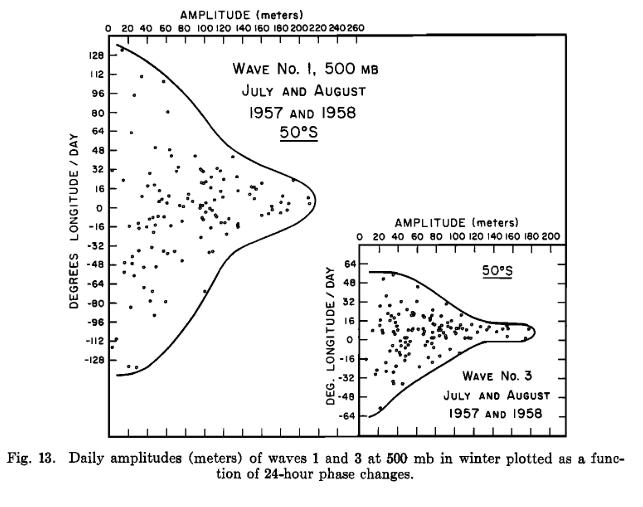

```{r setup, include=FALSE}
# Notification
start.time <- unclass(Sys.time())
min.time <- 10
knit_doc <- knitr::knit_hooks$get("document")
knitr::knit_hooks$set(document = function(x) {
   took <- unclass(Sys.time()) - start.time
   if (unclass(Sys.time()) - start.time >= min.time) {
      notify("Done knitting!", 
             paste0("Took ", round(took), " seconds"),
             time = 5)
   }  
   knit_doc(x)
})

name <- tools::file_path_sans_ext(knitr::current_input())
knitr::opts_chunk$set(echo = FALSE,
                      cache = TRUE,
                      warning = FALSE, message = FALSE,
                      out.extra = "", 
                      cache.path = paste0("cache/", name, "/"),
                      fig.path = paste0("fig/", name, "/"))

library(metR)
library(data.table)
library(ggplot2)
library(metR)
library(magrittr)
library(circular)
library(RcppRoll)
library(patchwork)
library(lubridate)

here <- here::here
source("scripts/helperfun.R")

data.world <- BuildMap(res = 1, smooth = 1)
map.world <- geom_map2(data.world)
map.SH <- geom_map2(data.world[lat %b% c(-90, 20)], color = "gray20")

lev.breaks <- c(1000, 500, 300, 200, 100, 50, 10)

theme_elio <- theme_minimal(base_size = 11) +
   theme(
      # text = element_text(family = font_rc),
      legend.position = "bottom", legend.box = "vertical",
      panel.spacing.y = unit(5, "mm"),
      panel.spacing.x = unit(5, "mm"),
      legend.spacing = unit(2, "mm"),
      plot.margin = grid::unit(rep(3, 4), "mm"),
      legend.title = element_blank(),
      legend.box.spacing = unit(3, "mm"),
      legend.margin = margin(t = -5),
      panel.grid = element_line(color = "gray50", size = 0.2, linetype = 3),
      panel.ontop = TRUE)
theme_set(theme_elio)
guide_colorstrip_bottom <- function(width = 25, height = 0.5, ...) {
   guide_colorstrip(title.position = "top", title.hjust = 0.5,
                    barheight = height,
                    barwidth = width, ...)
}
```

Esto es inspirado por la figura 13 de @Loon1972 donde plotea la amplitud de la onda en función del desplazamiento (que no es estrictamente la velocidad de fase).

```{r}

```


¿Es una posible forma de ver el tema de ver la estacionariedad más desde lo dinámico? Veamos. 

Tengo que usar datos diarios porque con los mensuales no se puede hablar de desplazamiento, me parece. Leyendo los datos de NCEP para 500hPa y 50°S entre 1980 y 2017 inclusive, calculo el desplazamiento como lo hizo @Loon1972. Hago la diferencia y le rest o le sumo $2\pi$ si ésta es mayor que $\pi$ o menor que $-\pi$, respectivamente. 

```{r read-data}
gh <- ReadNetCDF("~/DATOS/NCEP Reanalysis/hgt.daily.nc", "hgt",
                 subset = list(lat = -50,
                               level = 500,
                               time = c("1980-01-01", "2017-12-31")))

qs <- gh[, FitWave(hgt, 1:4), by = .(time, lat)] %>% 
   .[, phase.c := circular(phase*k, modulo = "2pi")]


qs[, dphase := (phase - shift(phase))*k, by = k]
qs[dphase > pi, dphase := dphase - pi*2]
qs[dphase < -pi, dphase := dphase + pi*2]
qs[, dphase := dphase/k]
```

Ahora veamos de reproducir el gráfico anterior pero con k = 1-4.

```{r}
qs %>% 
   ggplot(aes(amplitude, dphase*180/pi)) +
   geom_point(alpha = 0.05, size = 0.2) +
   scale_y_continuous("Desplazamiento (grados por día)") +
   scale_x_continuous("Amplitud") +
   facet_wrap(~k, scales = "free_y")
```

Maso :'(. Ciertamente tanto la amplitud como la cantidd de casos es máxima cerca del cero desplzamiento para la onda 1. la onda 4 tiene el máximo bien lejos del cero, indicando que su amplitud es máxima cuando el desplazamiento no es cero. Esto se puede ver mejor ploteando el valor absoluto del desplazamiento.

```{r}
qs %>% 
   ggplot(aes(amplitude, abs(dphase*180/pi))) +
   geom_point(alpha = 0.05, size = 0.2) +
   scale_y_continuous("Desplazamiento absoluto (grados por día)") +
   scale_x_continuous("Amplitud") +
   facet_wrap(~k, scales = "free_y")
```

Pero si bien la onda 4 se distingue bien como no estacionaria, no se ve bien la diferencia entre 1, 2 y 3.

Puedo combinar el criterio dinámico (velocidad de fase) con el estadístico (fase).

```{r}
qs %>% 
   .[, month := month(time)] %>% 
   .[!is.na(dphase)] %>%
   # .[k == 3] %>% 
   ggplot(aes(phase*k*180/pi, dphase*180/pi)) +
   # stat_bin_hex(bins = 20) +
   # stat_summary_hex(aes(z = amplitude), 
                    # bins = 20) +
   # geom_contour(data = dens, aes(x = x, y = y, z = z)) +
   geom_point(alpha = 0.05, size = 0.2) +
   # geom_hline(data = qs[, weighted.mean(dphase, amplitude, na.rm = TRUE), 
   # by = k],
   # aes(yintercept = V1, group = k)) +
   facet_wrap(~k, ncol = 2, scales = "free_y") +
   # coord_polar(theta = "y") +
   scale_fill_viridis_c()  +
   scale_y_continuous("Desplazamiento (grados por día)") +
   scale_x_continuous("Fase por k")
```

Ahora la onda 1 se destaca máx por su fase consistente que por su poco desplazamiento. Le sigue la onda 3 y luego la 2. La onda 4 no tiene fase predilecta. En este gráfico se perdió la información de la amplitud, que también es importante. La agrego en la figura que sigue, donde el color es la suma de la amplitud normalizada. 

```{r}
qs %>% 
   .[, month := month(time)] %>% 
   .[!is.na(dphase)] %>%
   .[, amplitude := amplitude/max(amplitude), by = k] %>%
   # .[k == 3] %>% 
   ggplot(aes(phase*k*180/pi, dphase*180/pi)) +
   stat_summary_hex(aes(z = amplitude), 
                    bins = 20, fun = "sum") +
   # geom_contour(data = dens, aes(x = x, y = y, z = z)) +
   # geom_point(size = 0.1, alpha= 0.5) +
   # geom_hline(data = qs[, weighted.mean(dphase, amplitude, na.rm = TRUE), 
   # by = k],
   # aes(yintercept = V1, group = k)) +
   facet_wrap(~k, ncol = 2, scales = "free_y") +
   # coord_polar(theta = "y") +
   scale_fill_viridis_c()  +
   scale_y_continuous("Desplazamiento (grados por día)") +
   scale_x_continuous("Fase por k")
```

En este gráfico se puede ver que si bien la onda 2 y la 3 son similares en cuanto a la frecuencia de casos en una determinada fase y cambio de fase, el efecto de amplitud es más intenso en la onda 3. La onda 1 sigue siendo la recontra campeona.  

# Referencias


