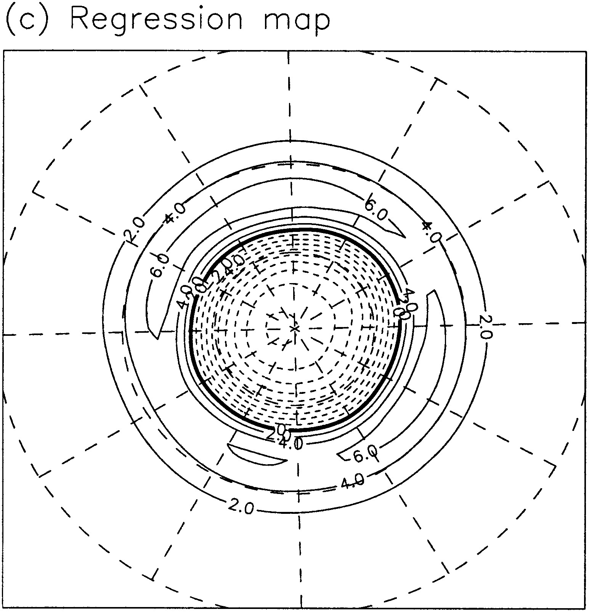
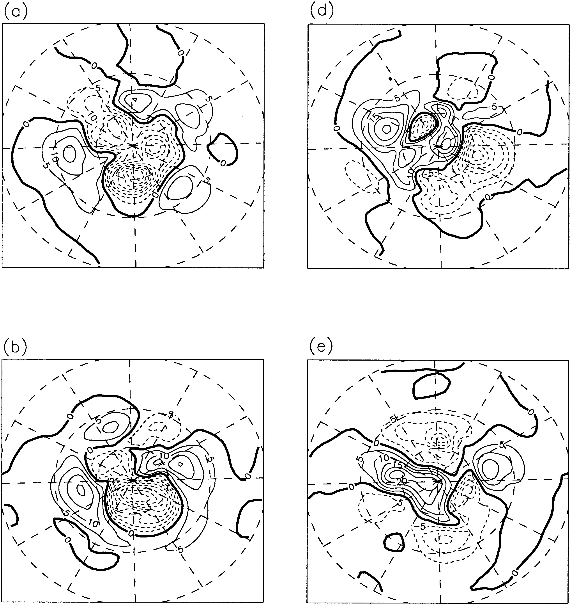
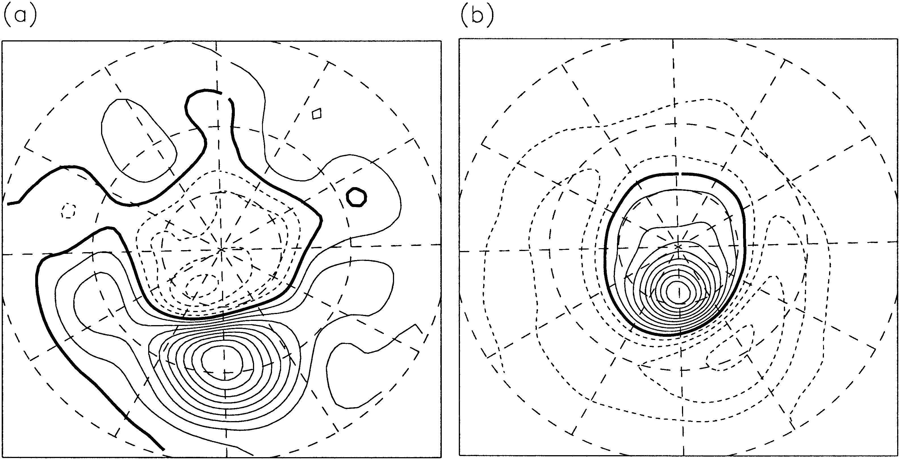

```{r setup, include=FALSE}
# Notification

knitr::opts_chunk$set(echo = FALSE, warning = FALSE, message = FALSE)

library(metR)
library(data.table)
library(ggplot2)
library(magrittr)
library(patchwork)
library(here)
library(ggh4x)
library(glue)
library(ggperiodic)
here <- here::here

source(here("scripts", "helperfun.R"))
source(here("scripts", "data_locations.R"))

hemisphere <- function(lat) {
   factor(ifelse(lat < 0, "sh", "nh"), levels = c("nh", "sh"),
          labels = c("Hemisferio norte", 
                     "Hemisferio sur"), 
          ordered = TRUE)
}


knitr_set_timer()
knitr_set_cache(cache.extra = 42)
```


```{r, cache = FALSE}
hgt <- ReadNetCDF(ERA5(), 
                  subset = list(time = c("1979-01-01", NA),
                                lev = 700, 
                                lat = c(-90, 0)),
                  vars = c(hgt = "z")) %>% 
   .[, hgt := hgt/9.8] 
hgt[, hgt_a := hgt - mean(hgt), by = .(lon, lat, lev, month(time))]
hgt <- hgt[, hgt_m := mean(hgt_a), by = .(lat, lev, time)] %>% 
   .[, hgt_z := hgt_a - hgt_m]
```

En "The Structure and Composition of the Annular Modes in an Aquaplanet General Circulation Model" y "Zonal Asymmetries, Teleconnections, and Annular Patterns in a GCM" (Cash et.al. 2002 y 2005, desde ahora CKV), los autores analizan simulaciones aquaplanet (en el primero) y con algunas asimetrías zonales (en el segundo) estudiando la configuración de sus "modos anuales" o, más bien, el primer EOF. 

Del modelo aquaplanet ven que aparece un módulo anular en el primer EOF perfectamente zonalmente simétrico (salvo pequeños desvíos debido a la muestra finita) pero que cuando ven los "eventos" particulares, éstos tienen asimetrías zonales. 

```{r, fig.cap = "Mapa de regresión del primer EOF de la SLP del modelo aquaplanet."}

```

```{r, fig.cap = "SLP de casos seleccionados con eventos positivos (izquierda) y negativos (derecha)"}

```


Dada esta "desconexión" entre la estructura del EOF y los casos que representa, buscan una forma alternativa de caracterizar esta variabilidad de baja frecuencia. Lo que hacen es hacer mapas de correlación para buscar teleconexiones usando como punto base distintas latitudes (como la simulación es zonalmente simétrica usan todos los puntos en longitud, rotando). Ven es que las correlaciones negativas se maximizan cuando los puntos están en 65° y en 35°. 

```{r, fig.cap = "Mapas de correlación usando como punto base 35° (izquierda) y 65° (derecha)"}

```

Estos mapas son como versiones "localizadas zonalmente" del modo anular. Esto implica, en palabras de CKV:

> La variablidad de baja frecuencia de la presión a nivel del mar del modelo está caracterizada por dipolos meridionales con centros cerca de 35° y 65° de latitud y escala zonal de entre 60° y 90°. Dado que estos eventos están uniformemente distribuidos en la dirección zonal en el modelo aquaplanet, son representados como un único EOF zonalmente uniforme.


# Respuesta?

Lo que plantea CKV es interesante... pero, al menos en los datos reales, no es consistente con la coherencia temporal observada entre latitudes en el SAM. Esto ya lo vimos en lo anterior (26-SAM_asim) pero acá lo muestro con un método ligéramente distinto. 

Para cada longitud, tomo un gajo de 90° de ancho centrado en esa longitud y le calculo EOF.


```{r, fig.cap = "Valor del EOF1 de la longitud central para el EOF computado para cada gajo de 90° de ancho."}
lon_width <- 90
lon_halfwidth <- lon_width/2

hgt2 <- qwrap(hgt, lon = c(0, 360) ~ c(-lon_halfwidth, 360 + lon_halfwidth)) %>% 
   .[, hgt := hgt_a*sqrt(cos(lat*pi/180))] 

lon_eofs <- lapply(unique(hgt$lon), function(base_lon) {
   hgt2 %>% 
      .[lon %between% (base_lon + c(-lon_halfwidth, lon_halfwidth))] %>% 
      .[, .(eof = list(EOF(hgt ~ time | lon + lat, n = 1:2, data = .)))] %>% 
      .[, base_lon := base_lon] %>% 
      .[]
}) %>% 
   rbindlist()


lon_eofs[, eof[[1]]$right, by = .(base_lon)] %>% 
   # .[, .(hgt = mean(hgt)), by = .(lon = base_lon, lat, PC)] %>% 
   .[base_lon == lon] %>%
   .[PC == "PC2", hgt := hgt*sign(hgt[lat == -20]), by = lon] %>% 
   .[PC == "PC1"] %>% 
   ggplot(aes(lon, lat)) +
   geom_contour_fill(aes(z = hgt)) +
   scale_x_longitude(xwrap = c(-180, 360)) +
   scale_y_latitude(limits = c(-90, -20)) +
   scale_fill_divergent() +
   coord_polar() +
   facet_grid( ~ PC)
```

El resultado es un modo anular. Esto no es extraño y aún es consistente con el argumento de CKV, pero...


<!-- ```{r} -->
<!-- lon_eofs[, eof[[1]]$sdev, by = base_lon] %>%  -->
<!--    ggplot(aes(base_lon, r2)) + -->
<!--    geom_line(aes(color = PC)) + -->
<!--    scale_y_continuous(limits = c(0, 1)) + -->
<!--    scale_x_longitude() -->
<!-- ``` -->


```{r, fig.cap = "Correlación de el EOF temporal de cada longitud con el promedio de los EOFs temporales."}
lon_eofs[, eof[[1]]$left, by = base_lon] %>% 
   .[PC == "PC1"] %>%
   # .[correction, on = .NATURAL] %>% 
   # .[, hgt := hgt*V1] %>% 
   .[, hgt_mean := mean(hgt), by = .(time, PC)] %>% 
   .[, cor(hgt, hgt_mean), by = .(base_lon, PC)] %>% 
   ggplot(aes(base_lon, V1)) +
   geom_line() +
   scale_y_continuous(limits = c(0, 1)) +
   scale_x_longitude()
```


```{r, fig.cap = "Correlación cruzada del EOF temporal de cada longitud"}
lon_eofs[, eof[[1]]$left, by = .(lon = base_lon)] %>% 
   .[PC == "PC1"] %>%
   .[, widyr::pairwise_cor(.SD, lon, time, hgt), by = PC] %>% 
   ggplot(aes(item1, item2)) +
   geom_contour_fill(aes(z = correlation), na.fill = TRUE) +
   # geom_raster(aes(fill = correlation)) +
   scale_fill_divergent() +
   scale_x_longitude() +
   scale_y_longitude() +
   coord_equal()
```

De nuevo se ve que la variabilidad asociaoda al modo anular tiene coherencia temporal entre distintas longitudes. 


```{r, fig.cap = "Regresión entre el EOF1 calculado usando distintos \"gajos\" (marados con las líneas meridionales) y la altura geopotencial en 700hPa."}

wrap_ <- function(lon) {
   lon <- ifelse(lon <= 0, lon + 360, lon)
   lon <- ifelse(lon >= 360, lon - 360, lon)
   lon
}

base_lons <- seq(0, 360 - 60, by = 60)
lims <- data.table(base_lon = unique(lon_eofs$base_lon)) %>% 
   .[, side1 := wrap_(base_lon + 45)] %>% 
   .[, side2 := wrap_(base_lon - 45)] %>% 
   .[base_lon %~% base_lons] 

lon_eofs[, eof[[1]]$left, by = .(base_lon)] %>% 
   .[base_lon %~% base_lons] %>% 
   .[PC == "PC1"] %>% 
   setnames("hgt", "EOF") %>% 
   hgt[., on = "time", allow.cartesian = TRUE] %>% 
   .[, FitLm(hgt_a, EOF, se = TRUE), by = .(lon, lat, base_lon)] %>%
   rm_intercept() %>% 
   .[, pvalue := Pvaluate(estimate, std.error, df), by = .(base_lon)] %>% 
   ggplot(aes(lon, lat)) +
   geom_contour_fill(aes(z = estimate)) +
   geom_vline(data = lims, aes(xintercept = side1)) +
   geom_vline(data = lims, aes(xintercept = side2)) +
   # geom_vline(aes(xintercept = wrap_(base_lon - lon_halfwidth))) +
   geom_contour2(aes(z = pvalue), breaks = 0.05) +
   stat_subset(aes(subset = pvalue <= 0.05 & is.cross(lon, lat, 1)), size = 0.1, apha = 0.1) +
   scale_x_longitude() +
   scale_y_latitude() +
   scale_fill_divergent() +
   coord_polar() +
   facet_wrap(~base_lon, labeller = labeller(base_lon = LonLabel))
```

Estas regresiones confirman nuevamente que la variabilidad asociada al modo anular es coherente en todo el hemisferio. Hay diferencias, por supuesto, que se dan debido a que: 

1. El patrón del modo anular no es 100% simétrico sino que hay centros de acción relativamente más intensos. Por lo que es lógico que el EOF computado en un área que incluye ese centro de acción represente más lo que pasa en ese centro que lo que pasa en el resto del hemisferio. 

2. Hay otros procesos además del SAM que afectan la variabilidad local, por lo que también es de esperar que éstos queden mezclados cuando se hace el EOF más local. Esto se nota particularmente en la regresión hecha con el EOF centrado en 120 °P y 60°O, donde hay una clara influencia de un patŕon tipo PSA2. 

---

### Conclusión:

* El punto de CKV es interesante: ver un modo anular en el EOF no implica necesariamente que éste exista en los datos; puede ser un artefacto estadístico. 

* Usando los datos de reanálisis, el patrón anular aparece coherente usando varias metodologías distintas, por lo que no parece ser un artefacto estadístico sino unaa característica física coherente de la atmósfera. 

* Casos específicos de "eventos SAM" por supuesto que no van a ser idénticos al patrón general ya que además están afectados por un montón de otros procesos. 

* Estaría bueno hacer este mismo análisis en el aquaplanet. 


