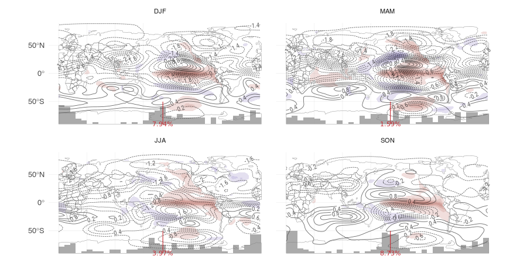

```{r setup, include=FALSE}
# Notification
start.time <- unclass(Sys.time())
min.time <- 10
knit_doc <- knitr::knit_hooks$get("document")

options(htmltools.dir.version = FALSE)
knitr::knit_hooks$set(document = function(x) {
   took <- unclass(Sys.time()) - start.time
   if (unclass(Sys.time()) - start.time >= min.time) {
      notify("Done knitting!", 
             paste0("Took ", round(took), " seconds"),
             time = 5)
   }  
   knit_doc(x)
})


name <- tools::file_path_sans_ext(knitr::current_input())
knitr::opts_chunk$set(
   echo = FALSE,
   fig.path = paste0("fig/", name, "/"),
   message = FALSE,
   warning = FALSE,
   cache = TRUE, 
   cache.lazy = FALSE,
   cache.extra = 42,
   cache.path = paste0("cache/", name, "/")
)
# knitr::opts_chunk$set(fig.width = 13, 
#                       fig.height = 7)
source(here::here("scripts", "helperfun.R"))
source(here::here("scripts", "maps.R"))

library(metR)
library(data.table)
library(ggplot2)
# library(magrittr)
library(patchwork)
library(here)
library(tagger)
library(kableExtra)

theme_set(theme_elio())
guide_colorstrip_bottom <- function(width = 25, height = 0.5, ...) {
   guide_colorstrip(title.position = "top", title.hjust = 0.5,
                    barheight = height,
                    barwidth = width, ...)
}
setnames <- function(x, ...) {
   names <- c(...)
   # print(names)
   data.table::setnames(x, unname(names), names(names))
}

lapply_p <- function(x, FUN, ...) {
   pb <- progress::progress_bar$new(total = length(x), 
                                    format = "[:bar] :percent - :eta")
   
   FUN_pb <- function(x, ...) {
      pb$tick()
      FUN(x, ...)
   }
   
   lapply(x, FUN_pb, ...)
}


geom_coords <- function() {
   list(
      no_grid,
      annotate("segment",
               y = seq(-90, 0, by = 15),
               yend = seq(-90, 0, by = 15),
               x = 0,
               xend = 360,
               size = 0.1, alpha = 0.5),
      
      annotate("segment",
               x = seq(0, 360 - 30, by = 30),
               xend =  seq(0, 360 - 30, by = 30),
               y = -90 + 15,
               yend = Inf,
               size = 0.1, alpha = 0.5),
      shadowtext::geom_shadowtext(data = data.frame(x = 0, y = seq(-90 + 15, 0, 
                                                                   by = 15)),
                                  aes(x, y, label = LatLabel(y)), size = 1.5, 
                                  alpha = 0.7,
                                  colour = "black",
                                  bg.colour = "white")
      
   )
}
no_grid <- theme(panel.grid = element_blank())
coord_polar <- function(ymax = -20, ...) {
   
   x <- c(seq(0, 360, length.out = 40), 
          seq(360, 0, length.out = 40), 
          0)
   y <- c(rep(ymax, length.out = 40), 
          rep(60, length.out = 40), 
          ymax)
   
   cbind(x, y) %>% 
      list() %>% 
      sf::st_polygon() %>% 
      sf::st_sfc(crs = "+proj=latlong") -> white
   
   list(
      geom_sf(data = white, inherit.aes = FALSE, 
              fill = "white", 
              colour = "white", size = 2),
      coord_sf(ylim = c(-90, ymax), 
               lims_method = "box",
               crs = "+proj=laea +lat_0=-90",
               default_crs = "+proj=longlat",
               label_axes =  "----", ...)
   )
}

periodic_lon <- function(x){
   ggperiodic::periodic(x, lon = c(0, 360))
}

label_placer_vertical <- function(x_ref, rot_adjuster = isoband::angle_halfcircle_bottom()) {
   force(x_ref)
   
   metR:::as_placer(
      function(x, y) {
         which(x %~% x_ref)
      }, 
      rot_adjuster = rot_adjuster
   )
}
scale_color_exp <- function(aesthetics = c("colour"), ...){
   labels <- c("Aquaplanet", "Complete South America", "Tropical South America", 
               "Tropical Africa", "Tropical Australia",
               "Realistic Tropics", "ERA5")
   
   
   scale_color_manual("Experimentos",
                      values = setNames(c(RColorBrewer::brewer.pal(6, "Dark2"), "black"),
                                        labels), aesthetics = aesthetics,
                      ...)
   
}

keep_lat <- function(data, lat = -55) {
   which_lat <- lat
   data[, .SD[lat %~% which_lat], by = exp] 
}


sink <- capture.output(old <- sf::sf_use_s2(FALSE))

setnames2 <- function(x, ...) {
   names <- c(...)
   # print(names)
   data.table::setnames(x, unname(names), names(names))
   x
}
D <- `[`
```

```{r slider}
slider <- function(name, min, max, start, step) {
   
   id_range <- paste0(name, "-range")
   id_img <- paste0(name, "-img")
   id_label <- paste0(name, "-label")
   
   
   ui <- glue::glue('<div style="text-align:center"><input style="width: 50%;" id="{id_range}" type="range" min="{min}" max="{max}" value="{start}" step="{step}" oninput="showVal_{name}(this.value)" onchange="showVal_{name}(this.value)" /> <br/>
<p align = "center" id="{id_label}">{start}º</p>
</div>')
   
   js <- glue::glue('<script>
            function showVal_{name}(newVal){{
            document.getElementById("{id_label}").innerHTML=newVal + "º";
            document.getElementById("{id_img}").src = "{name}/" + newVal+ ".png";
            }}
            
            function showValExternal_{name}(newVal){{
            document.getElementById("{id_label}").innerHTML=newVal + "º";
            document.getElementById("{id_img}").src = "{name}/" + newVal+ ".png";
            document.getElementById("{id_range}").value = newVal;
            }}
         </script>', )
   
   cat(ui)
   cat("\n")
   cat(js)
   
}


set_slider <- function(name, value) {
   glue::glue('<a href="javascript:showValExternal_{name}({value})">{value}º</a>')
}

```

En el trabajo de PSA vi que los mapas de regresión de SST asociados a distintas fases del PSA muestran un ENSO con distintas localizaciones.

```{r figura-ceof, fig.cap = "Mapas de regresión de PSA en sus distintas fase con sst (izquierda) y funcíon corriente en 200hPa (derecha)."}
knitr::include_graphics("images/sst-psi-2-1.png")
```

La pregunta ahora es si puedo ver la misma relación en reversa.
Es decir, empezando con el ENSO en sus distintas localizaciones, ¿puedo ver un PSA con cambio de fase en los campos de regresión de la altura geopotencial?

Para eso voy a necesitar una forma de definir las localizaciones del ENSO.
En la literatura están los índices de las "cajas" del ENSO (ENSO1+2, ENSO3, ENSO4, ENSO3.4) y también está el índice de El Niño Modoki.
Algunos papers usan una definición de ENSO Central Pacific y Eastern Pacific a partir de las primeras dos componentes principales.

Yo voy a hacer algo parecido a esto último, pero dado que lo que estoy buscando es esencialmente una onda que cambia de fase, voy a usar EOF complejos nuevamente.

```{r download_ersst}
download_ersst <- function(file) {
   base_url <- "http://www.ncei.noaa.gov/pub/data/cmb/ersst/v5/netcdf/ersst.v5."
   
   years <- 1854:2020
   months <- formatC(1:12, width = 2, flag = "0")
   dates <- data.table::CJ(years, months)[, paste0(years, months)]
   
   urls <- paste0(base_url, dates, ".nc")
   
   files <- vapply(urls, function(url) {
      file <- tempfile(fileext = ".nc")
      message(paste0("Descargando ", file))
      download.file(url, file, quiet = TRUE)
      file
   }, character(1))
   
   data <- lapply(files, function(file) metR::ReadNetCDF(file, vars = c(t = "sst")))
   data <- data.table::rbindlist(data)
   
   saveRDS(data, file)
   file
}
```


```{r download-data}
file <- here::here("DATA", "ersst.mon.Rds")

if (!file.exists(file)) {
   download_ersst(file)
}
```

```{r sst}
sst <- readRDS(file) %>% 
   D(, time := round_date(time, "month"))

gw <- sst %>% 
   na.omit() %>% 
   D(, .(gw = weighted.mean(t, cos(lat*pi/180))), by = time) %>% 
   D(, gw := gw - mean(gw), by = .(month(time))) %>% 
   D(, gw :=  predict(loess(gw ~ as.numeric(time), span = 30*12/.N)))

sst <- sst[gw, on = "time"] %>% 
   D(, sst_filt := predict(lm(t ~ gw)), by = .(month(time)))


tendencia_enso <- sst %>%
   copy() %>% 
   D(year(time) %between% c(1949, 2006)) %>% 
   D(, sst_filt := Anomaly(sst_filt), by = .(lon, lat, month(time))) %>% 
   D(, FitLm(sst_filt, time), by = .(lon, lat)) %>% 
   rm_intercept()

tendencia_total <- sst %>%
   copy() %>% 
   D(year(time) %between% c(1949, 2006)) %>% 
   D(, t := Anomaly(t), by = .(lon, lat, month(time))) %>% 
   D(, FitLm(t, time), by = .(lon, lat)) %>% 
   rm_intercept()

rbind(enso = tendencia_enso, 
      total = tendencia_total, idcol = "parte") %>% 
   # dcast(lon + lat ~ parte, value.var = "estimate") %>% 
   # D(, no_enso := total - enso) %>% 
   # melt(id.vars = c("lon", "lat")) %>% 
   ggplot(aes(lon, lat)) + 
   geom_contour_fill(aes(z = estimate), bins = 15) +
   scale_fill_divergent() +
   facet_wrap(~parte)
```

```{r}

sst %>%
   copy() %>% 
   D(, sst_filt := Anomaly(sst_filt), by = .(lon, lat, month(time))) %>% 
   D(, FitLm(sst_filt, time), by = .(lon, lat)) %>% 
   rm_intercept() %>% 
   D(, weighted.mean(estimate, cos(lat*pi/180), na.rm = TRUE))
```


```{r enso}
enso <- sst %>% 
   D(lon %between% ConvertLongitude(c(-170, -120)) & lat %between% c(-5, 5)) %>% 
   D(, .(enso34 = weighted.mean(sst_filt, cos(lat*pi/180))), by = .(time)) %>% 
   D(, enso34 := enso34 - mean(enso34[year(time) >= 1979]), by  = month(time)) %>%
   D(, enso34 := enso34/sd(enso34[year(time) >= 1979]), by = month(time))
```

Lo que voy a hacer es calcular el EOF complejo de la SST[^sst-fuente] promediada entre 5ºS y 5ºN.
Un problema es que no tengo valores sobre los continentes así que voy a rellenar con una interpolación constante.[^periodico]
Los valores imputados son un sinsentido, pero no debería importar demasiado porque son siempre iguales.

[^sst-fuente]: [Extended Reconstructed Sea Surface Temperature](https://psl.noaa.gov/data/gridded/data.noaa.ersst.v5.html) entre 1979 y 2020. 

[^periodico]: Como estoy haciendo la transformada de Hilbert, está bueno que el domino sea periódico, por eso es que prefiero rellenar los continentes en vez de hacer el EOF sólo usando los datos del Pacífico.

Otra cosa que voy a hacer es rotar el EOF de manera que la parte real tenga la máxima correlación parcial con el índice ENSO 3.4[^enso34].

[^enso34]: Computado usando los mismos datos de SST: El promedio de las anomalías mensuales de SST entre 5ºS y 5ºN, y 127ºO y 170ºO y luego estandarizado.

```{r ensos}
set.seed(42)
ensos <- sst %>% 
   D(lat %between% c(-5, 5)) %>% 
   D(, mean( sst_filt), by = .(time, lon)) %>% 
   D(, V1 := approx(lon, V1, xout = lon, rule = 2)$y, by = .(time)) %>% 
   D(year(time) >= 1979) %>% 
   D(, V1 := V1 - mean(V1), by = .(month(time), lon)) %>% 
   D(, eof := spectral::analyticFunction(V1), by = time) %>% 
   D(, EOF(eof ~ time | lon, n = 1))
```


```{r rotate}
rotate <- function(z, angle = 0) {
   complex(real = cos(angle), imaginary = sin(angle)) * z
}

rotate_ReIm <- function(R, I, angle) {
   complex(real = cos(angle), imaginary = sin(angle)) * complex(real = R, imaginary = I)
}

angles <- seq(-pi, pi, by = .5*pi/180)
temp <- ensos$left %>%
   D(enso, on = "time") %>% 
   D(year(time) >= 1979)


rotations <- lapply(angles, function(a) {
   temp %>% 
      copy() %>% 
      D(, eof := rotate(eof, a)) %>% 
      na.omit() %>% 
      D(, ":="(R = Re(eof), I = Im(eof))) %>% 
      D(, partial_cor(enso34, R, I)) %>% 
      D(, rotation := a)
}) %>% 
   rbindlist()


best_rotation <- rotations[term == "R"][which.max(partial_correlation)]
best_rotation <- rotations[rotation == best_rotation$rotation]

ensos_first_pattern <-  ensos$right %>% 
   copy() %>% 
   D(, eof := rotate(eof, best_rotation$rotation[1])) 
```


```{r plot-eof, fig.cap = "Primer EOF complejo de SST promediada entre 5ºS y 5ºN.", fig.margin = TRUE}
null_lons <- sst %>%  
   D(lat %between% c(-5, 5)) %>% 
   D(is.na(t)) %>% 
   D(, unique(lon))


valid_lons <- sst %>% 
   D(year(time) >= 1979) %>% 
   D(lat %between% c(-5, 5)) %>% 
   D(, mean(t), by = .(time, lon)) %>% 
   D(lon %between% c(120, 300)) %>% 
   na.omit() %>% 
   D(, unique(lon)) 


ensos_first_pattern %>% 
   sep_ReIm(eof) %>% 
   D(lon %in% null_lons, eof := NA) %>% 
   ggplot(aes(lon, eof)) +
   geom_line(aes(color = part)) +
   scale_x_longitude()
```

La Figura \@ref(fig:plot-eof) muestra el patrón espacial del EOF complejo.
Una posibilidad para calcular el índice temporal (extendiéndolo en el pasao) es proyectando este patrón pero sólo en la región del Pacífico. 
El problema de hacer esto es que, como no tienen media nula, los patrones son sensibles al calentamiento global. 
El patrón de la parte Real, por ejemplo, va a dar muy negativo en caso de Niño, pero tambień en caso de un aumento global en la temperatura de todo el océano. 

```{r extended-malo, fig.cap= "enso extendido", fig.margin = TRUE}
pattern <- ensos_first_pattern %>% 
   sep_ReIm(eof) %>% 
   D(lon %in% valid_lons) 

sst %>% 
   D(lat %between% c(-5, 5)) %>% 
   D(, mean(sst_filt), by = .(time, lon)) %>% 
   D(, V1 := approx(lon, V1, xout = lon, rule = 2)$y, by = .(time)) %>% 
   D(, V1 := V1 - mean(V1[year(time) >= 1979]), by = .(month(time), lon)) %>%
   D(pattern, on = "lon", allow.cartesian = TRUE) %>% 
   D(, .(eof = mean(eof*V1), PC = "PC1"), by = .(time, part)) %>% 
   ggplot(aes(time, eof)) +
   geom_line(aes(color = stage(part, after_scale = alpha(color, 0.3)))) +
   geom_smooth(aes(color = part))
```

En efecto, usando el patrón de la Figura \@ref(fig:plot-eof) para extender el registro desde 1985 se consiguen las series temporales de la Figura \@ref(fig:extended-malo).
El efecto del calentamiento global se ve más pronunciado en la serie Real, donde antes de 1990 parecería que el Pacífico se encontraba en un estado casi permanente de Niña.
Esto es una ilusión causada simplemente porque la temperatura del océano era más fría en general.

Hay muchas posibilidades para resolver el problema y posiblemente ninguna sea la definitiva. 
Lo que voy a hacer yo ahora es restarle la media a los patrones. 
En vez de usar el patrón de la Figura \@ref(fig:plot-eof), voy a usar los patrones de la Figura \@ref(fig:patrones). 

```{r patrones, fig.cap = "Patrones sin la media"}
pattern <- ensos_first_pattern %>% 
   sep_ReIm(eof) %>% 
   D(lon %in% valid_lons) %>% 
   D(, eof := eof - mean(eof), by = part)

ggplot(pattern, aes(lon, eof)) +
   geom_line(aes(color = part))
```

Al tener media nula, estos patrones no son sensibles a cambios uniformes en la tempertura del Pacífico[^media-ceof]. 
La proyección la voy a hacer con los datos de SST desde 1854, restándole la climatología de 1979 en adelante.

[^media-ceof]: Acá tengo dudas si los EOFs que obtengo después son válidos o no, ya que como estos campos están manoseados y ya no son la transformada de Hilbert del otro, me es difícil pensar si el ángulo y la magnitud que obtengo tienen sentido. 


```{r}
enso_long <- sst %>% 
   D(lat %between% c(-5, 5)) %>% 
   D(, mean(sst_filt), by = .(time, lon)) %>% 
   D(, V1 := approx(lon, V1, xout = lon, rule = 2)$y, by = .(time)) %>% 
   D(, V1 := anomaly_smooth(V1, 30), by = .(lon, month(time))) %>% 
   # D(, V1 := V1 - mean(V1[year(time) >= 1979]), by = .(month(time), lon)) %>% 
   D(pattern, on = "lon", allow.cartesian = TRUE) %>% 
   D(, .(eof = mean(eof*V1), PC = "PC1"), by = .(time, part)) %>% 
   dcast(time ~ part, value.var  = "eof") %>% 
   D(, .(time, eof = complex(real = Real, imaginary = Imaginary))) 
```

Figura \@ref(fig:enso-sst) muestra los campos de regresión asociados a cada índice. 
Muestra un patrón típico de ENSO asociado a la parte real.
La parte imaginaria tiene vlaores positivos en el pacífico central/occidental y negativos en el pacífico oriental.
Esto indica que cuando ésta parte es positiva, desplaza las anomalías hacia el oeste y viceversa.

```{r enso-sst}
#| fig.cap = "Regresión de SSTs con el EOF complejo."

enso_long %>% 
   D(sst, on = "time") %>% 
   D(year(time) >= 1979) %>% 
   sep_ReIm(eof, format = "wider") %>% 
   D(, t := t - mean(t), by = .(lon, lat, month(time))) %>% 
   D(, FitLm(t, Real, Imaginary), by = .(lon, lat)) %>% 
   rm_intercept() %>% 
   ggplot(aes(lon, lat)) +
   geom_contour_fill(aes(z = estimate)) +
   geom_qmap() +
   labs(x = NULL, y = NULL) +
   scale_fill_divergent(guide = "none") +
   facet_wrap(term~., ncol = 1)
```

```{r with-enso}
#| fig.cap: > 
#|    Valores del eof complejo en el eje horizontal vs. ENSO3.4 en el eje vertical. 
#|    Muestra la alta correlación entre la parte real y el índice ENSO3.4"

enso_long %>% 
   sep_ReIm(eof) %>% 
   D(enso, on = "time") %>% 
   D(year(time) >= 1979) %>% 
   ggplot(aes(eof, enso34)) +
   geom_point() +
   geom_text(data = ~.x[, cor(eof, enso34), by = part], 
             aes(label = scales::number(V1)), x = .045, y = -1) +
   scale_y_continuous() +
   facet_wrap(~part) 
```

La Figura \@ref(fig:with-enso) muestra la relación entre el índice ENSO3.4 y las dos partes del EOF complejo.
Hay una alta correlación entre el índice y la parte real, mientras que la correlación con la parte imaginaria es nula.
Sin embargo, existe una clara relación no lineal entre la parte imaginaria y el ENSO34.
Tanto valores altos como bajos (negativos) del índice están asociados a valores negativos de la parte imaginaria.


```{r hist}
#| fig.cap: > 
#|    Relación entre la fase del eof (eje horizontal) y la magnitud (eje vertical derecho, puntos) 
#|    e histograma que muestra la frecuencia observada de cada fase (barras, eje vertical izquierdo).
#|    En colores, la clasificación de eventos ENSO según el índice ENSO34 (+- 0.5).

is_enso_oni <- function(enso34) {
   cut(enso34, c(-Inf, -0.5, 0.5, Inf), labels = c("Niña", "Neutro", "Niño"))
}
scale_color_enso <- function() {
   scale_color_manual(name = "ENSO",
                      values = c("Niña" = "#3689e6",
                                 "Neutro" = "#abacae",
                                 "Niño" = "#de3e80"))
}
enso_long %>% 
   D(enso, on = "time") %>% 
   D(year(time) >= 1979) %>%
   ggplot(aes(Arg(eof))) +
   geom_histogram(aes(Arg(eof), y = stat(density*width)), boundary = 0, binwidth = 10*pi/180,
                  inherit.aes = FALSE) +
   geom_point(aes(y = Mod(eof)/2, color = is_enso_oni(enso34))) +
   # geom_point(aes(y = abs(enso34)*10, color = is_enso_oni(enso34))) +
   scale_x_continuous("Phase", 
                      breaks = seq(-pi - 1/4*pi, pi - 1/4*pi, by = 45*pi/180),
                      labels = function(x) paste0(round(x*180/pi, 5), "º")) +
   scale_y_continuous("Frecuencia (barras)", label = scales::percent_format() ,
                      sec.axis = sec_axis(~.x*2, name = "Mod(eof) (puntos)")) +
   # ggplot2::coord_polar() +
   scale_color_enso()
```

La Figura \@ref(fig:hist) muestra un histograma de la fase del EOF, mostrando que las fases más comunes son las cercanas a 0 (Real positivo, Niño) y 180 (Real negativo, Niña). Esto significa que la principal oscilación de ENSO es en el "eje" del ENSO canónico. El ENSO casi nunca se encuentra en la fase -90º (Imaginario negativo, indicando anomalías de SST corridas hacia el este) pero sí hay un poco más cerca de 90º (imaginario positivo, indicando anomalías de SST corridas hacia el oeste).

La Figura \@ref(fig:hist) también muestra, en puntos, la magnitud y fase observadas en cada mes, junto con el tipo de evento ENSO categorizado como $\pm0.5$ ENSO3.4. Esto muestra que no sólo las fases cercanas al ENSO canónico son las más comunes, sino que también son las asociadas con magnitudes más altas. 

En resumen, 

* el ENSO suele alinearse en el eje del ENSO canónio con mayor frecuencia,
* el ENSO es más intenso (tanto positivo como negativo) cuando se alínea con el ENSO canónico,
* los desvíos significativos con respecto al ENSO canónico se dan únicamente en la dirección del centro de anomalías positivas corrido hacia el oeste.

```{r}
fixed_smooth <- function(formula, data = NULL, weights = NULL, span, ...) {
   n <- nrow(data)
   span <- span/n
   
   loess(formula = formula, data = data, span = span, ...)
}

enso_long %>% 
   sep_ReIm() %>% 
   D(, eof_sm := predict(loess(eof ~ as.numeric(time), degree = 1, 
                               span = (12*30+1)/.N)), by = part) %>% 
   ggplot(aes(time, eof)) +
   geom_line(aes(color = stage(part, after_scale = alpha(color, 0.3)))) +
   geom_line(aes(y = eof_sm, color = part)) 
```


```{r}
enso_long %>% 
   D(enso, on = "time") %>% 
   D(, period := cut_width(year(time), 30, boundary =  min(year(time)), dig.lab = 100)) %>%
   # D(year(time) >= 1979) %>% 
   ggplot(aes(Arg(eof))) +
   geom_histogram(aes(Arg(eof), y = stat(density*width)), boundary = 0, binwidth = 10*pi/180,
                  inherit.aes = FALSE) +
   # geom_point(aes(y = Mod(eof)/2, color = is_enso_oni(enso34))) +
   # geom_point(aes(y = abs(enso34)*10, color = is_enso_oni(enso34))) +
   scale_x_continuous("Phase", 
                      limits = c(-pi, pi),
                      breaks = seq(-pi - 1/4*pi, pi - 1/4*pi, by = 45*pi/180),
                      labels = function(x) paste0(round(x*180/pi, 5), "º")) +
   scale_y_continuous("Frecuencia (barras)", label = scales::percent_format()) +
   scale_color_enso() +
   facet_wrap(~period)
```


```{r}
enso_long %>% 
   copy() %>% 
   D(, mod := Mod(eof)) %>% 
   D(, mod_sm := predict(loess(mod ~ as.numeric(time), degree = 1, 
                               span = (12*30+1)/.N))) %>% 
   ggplot(aes(time, mod)) +
   geom_line(alpha = 0.5) +
   geom_line(aes(y = mod_sm))

```


```{r}

tri_cube <- function(n) {
   d <- seq(-1, 1, length.out = n)
   (1 - abs(d)^3)^3 
}

center <- function(x, n) {
   N <- length(x)
   pad <- rep(NA, (n-1)/2)
   c( pad, x[n:N], pad)
}

k <-  (12*30+1)
enso_long %>% 
   copy() %>% 
   D(, mod := Mod(eof)) %>% 
   D(, sd := roll::roll_sd(mod, width = k, 
                           weights = tri_cube(k))) %>% 
   D(, sd := center(sd, k)) %>% 
   ggplot(aes(time, sd)) +
   geom_line(alpha = 0.5)
```


```{r cmap}
cmap_file <-file.path("DATA", "precip.mon.mean.nc")
if (!file.exists(cmap_file)) {
   download.file("https://downloads.psl.noaa.gov/Datasets/cmap/enh/precip.mon.mean.nc",
                 cmap_file)
}

cmap <- cmap_file %>% 
   ReadNetCDF(vars = c(pp = "precip"), 
              subset = list(time = unique(ensos$left$time))) 


land <- cmap %>%
   D(time == time[1]) %>%
   D(MaskLand(lon, lat) == TRUE) %>%
   D(, .(lon, lat)) %>%
   unique()

valid <- cmap %>% 
   # D(land, on = c("lon", "lat")) %>% 
   D(, mean(is.finite(pp)), by  = .(lon, lat, season(time))) %>% 
   D(V1 > 0.8, .(lon, lat, season))

cmap <- cmap %>% 
   D(, season := season(time)) %>% 
   D(valid, on = c("lon", "lat", "season")) %>% 
   D(, season := NULL)

```

```{r, cache = FALSE}
knitr::opts_chunk$set(eval = FALSE)
```


<!-- ```{r regr} -->
<!-- regr <-  -->
<!--    rbind( -->
<!--       enso_long %>%  -->
<!--          D(year(time) >= 1979) %>%  -->
<!--          D(sst, on = "time") %>%  -->
<!--          sep_ReIm(eof, format = "wider") %>%  -->
<!--          D(, t := t - mean(t), by = .(lon, lat, month(time))) %>%  -->
<!--          D(, FitLm(t, R, I), by = .(lon, lat, season(time))) %>%  -->
<!--          rm_intercept() %>%  -->
<!--          dcast(lon + lat + season ~ term, value.var = "estimate") %>%  -->
<!--          D(, variable := "sst"), -->


<!--       psi %>%  -->
<!--          D(, psi_a := psi - mean(psi), by = .(lon, lat, month(time))) %>%  -->
<!--          D(enso_long[year(time) >= 1979], on = "time") %>%  -->
<!--          na.omit() %>%  -->
<!--          sep_ReIm(eof, format = "wider") %>%  -->
<!--          D(, ":="(R = scale(R), I = scale(I)), by = .()) %>%  -->
<!--          D(, FitLm(psi_a, R, I), by = .(lon, lat, season(time))) %>%  -->
<!--          rm_intercept() %>%  -->
<!--          dcast(lon + lat + season ~ term, value.var = "estimate") %>%  -->
<!--          D(, variable := "psi"), -->


<!--       cmap %>%  -->
<!--          D(lat > -60) %>%  -->
<!--          D(, pp_a := Anomaly(pp, na.rm = TRUE)/sd(pp, na.rm = TRUE), by = .(lon, lat, month(time))) %>%  -->
<!--          D(enso_long[year(time) >= 1979], on = "time") %>%  -->
<!--          sep_ReIm(eof, format = "wider") %>%  -->
<!--          D(, FitLm(pp_a, R, I), by = .(lon, lat, season(time))) %>%  -->
<!--          rm_intercept() %>%  -->
<!--          dcast(lon + lat + season ~ term, value.var = "estimate") %>%  -->
<!--          D(, variable := "pp"), -->

<!--       use.names = TRUE -->
<!--    ) -->
<!-- ``` -->


<!-- ```{r make-slider-images, cache = FALSE} -->
<!-- # a <- 45*pi/180 -->
<!-- sf::sf_use_s2(FALSE) -->

<!-- angles <- seq(-180, 170, by = 10) -->
<!-- dir.create("ensos_slider") -->

<!-- ranges <- regr %>%  -->
<!--    D(, m := sqrt(R^2 + I^2)) %>%  -->
<!--    D(variable != "pp" | lon %between% c(-55, 60)) %>% -->
<!--    D(, max(m, na.rm = TRUE), by = variable)  -->

<!-- breaks_sst <- AnchorBreaks(exclude = 0, bins = 20)(c(-1, 1)*ranges[variable == "sst"]$V1) -->
<!-- breaks_psi <- AnchorBreaks(exclude = 0, bins = 25)(c(-1, 1)*ranges[variable == "psi"]$V1) -->
<!-- breaks_pp <- AnchorBreaks(exclude = 0, bins = 20)(c(-1, 1)*ranges[variable == "pp"]$V1) -->

<!-- h <- ensos$left %>%  -->
<!--    copy() %>%  -->
<!--    # D(season(time) == "SON") %>%  -->
<!--    # D(, eof := rotate(eof, angles[a]*pi/180)) %>%  -->
<!--    D(, a := Arg(eof)*180/pi) %>%  -->
<!--    D(, hist(a, plot = FALSE, breaks = seq(-180, 180, by = 10))[c("mids", "counts")], -->
<!--      by = season(time)) %>%  -->
<!--    D(, prop := counts/sum(counts), by = .(season)) %>%  -->
<!--    D(, mids := mids + 180) -->


<!-- w <- 900 -->
<!-- files <- lapply(seq_along(angles), function(a) { -->
<!--    file <- paste0("ensos_slider/", angles[a], ".png") -->
<!--    if (file.exists(file)) { -->
<!--       return(NULL) -->
<!--    } -->

<!--    png(file, width = w, height = w/2) -->
<!--    plot <- regr %>%  -->
<!--       copy() %>%  -->
<!--       D(, R := Re(rotate_ReIm(R, I, -angles[a]*pi/180))) %>%  -->
<!--       D(, psi.z := Anomaly(R), by = .(season, lat)) %>%  -->
<!--       D(variable == "psi", c("fx", "fy") := shceof::WaveFlux(.SD, p = 200),  -->
<!--         by = .(season)) %>%  -->
<!--       ggplot(aes(lon, lat)) + -->
<!--       geom_contour_fill(data = ~.x[variable == "sst"], aes(z = R, fill = ..level..),  -->
<!--                         breaks = breaks_sst) + -->
<!--       scale_fill_divergent_discretised(guide = "none") + -->

<!--       geom_contour2(data = ~.x[variable == "psi"], breaks = breaks_psi, -->
<!--                     size = 0.4, alpha = 0.6, -->
<!--                     aes(z = R, label = signif(..level..*1e7, digits = 2),  -->
<!--                         linetype = factor(-sign(..level..))), -->
<!--                     family = hrbrthemes::font_rc, -->
<!--                     label.placer = label_placer_flattest(45)) + -->
<!--       # geom_vector(data = ~.x[variable == "psi"], -->
<!--       #             aes(dx = fx, dy = fy)) + -->
<!--       # scale_mag() + -->
<!--       geom_rect(data = h,  -->
<!--                 alpha = 0.5, -->
<!--                 aes(xmin = mids - 5 , xmax = mids + 5, ymin = -90,  -->
<!--                     ymax = scales::rescale(counts, to = c(-90, -50))), inherit.aes = FALSE) + -->

<!--       ggfx::with_outer_glow( -->
<!--          geom_text(data = h[mids == angles[a]+180+5], -->
<!--                    aes(x = mids, y = -90, label = scales::percent(prop)), -->
<!--                    family = hrbrthemes::font_rc_light, color = "#c6262e") -->
<!--       ) + -->

<!--       geom_segment(data =h[mids == angles[a]+180+5], -->
<!--                    aes(x = mids, xend = mids, y = -90, yend = -50), -->
<!--                    color = "#c6262e") + -->
<!--       geom_qmap() + -->
<!--       labs(x = NULL, y = NULL) + -->

<!--       scale_y_continuous(limits = c(-90, 90)) + -->
<!--       scale_x_continuous(limits = c(0, 360)) + -->
<!--       facet_wrap(~season, ncol = 2) -->

<!--    print(plot) -->
<!--    dev.off() -->
<!--    return(file) -->
<!-- })  -->

<!-- ``` -->


<!-- Bien, ¿y qué hay de los efectos en el PSA? La Figura \@ref(fig:regresions) muestra mapas de regresión de SST en sombreado y función corriente en 200hPa en contornos para los distintos trimestres y distintas fases del ENSO complejo.  -->

<!-- Mirando al trimestre de SON, la anomalía negativa sobre el mar de Amundsen se desplaza considerablemente entre las fases `r set_slider("ensos_slider", -20)` y `r set_slider("ensos_slider", 30)` --las fases del ENSO complejo positivo más comunes.  -->
<!-- Las anomalías en la cercanía de Sudamérica también cambian considerablemente.  -->
<!-- Pero la forma del tren de ondas es bastante distinto.  -->
<!-- En la fase de `r set_slider("ensos_slider", 30)`, el tren de ondas está bien desarrollado y viene desde el Pacífico, con anomalías fuertes al Sur de las anomlaías de SST. -->
<!-- En la fase de `r set_slider("ensos_slider", -20)`, por ejemplo, el tren de ondas es mucho más hemisférico y parece emanar más desde el Índico más que desde el Pacífico.  -->


<!-- (ref:cap-regresions) Regresión trimestral de SST (sombreado) y función corriente en 200 hPa (contornos, valores $\times 1·10^7$). Las barras grises indican el histograma en función de la fase (similar a la Figura \@ref(fig:hist)) y el texto rojo indica la proporción de meses con determinada fase.  -->


<!-- ```{r regresions, fig.cap="(ref:cap-regresions)", fig.width = 12, fig.height=6, out.extra="id='ensos_slider-img'", fig.fullwidth = TRUE} -->
<!--  -->
<!-- ``` -->

<!-- ```{r regresions-slider, results='asis'} -->
<!-- slider("ensos_slider", -180, 170, 0, 10) -->
<!-- ``` -->


<!-- En MAM también hay indicación de un poco de dependencia, aunque menor que en SON.  -->
<!-- Por ejemplo, el tren de onda sólo cambia ligerametne entre  -->
<!-- `r set_slider("ensos_slider", 0)` y `r set_slider("ensos_slider", 80)`. -->

<!-- En JJA, parecería que la localización de las anomalías de función corriente no cambian con la localización de las anomalías de SST.  -->
<!-- Las anomalías no cambian entre `r set_slider("ensos_slider", 100)` y  -->
<!-- `r set_slider("ensos_slider", 0)`. -->
<!-- Lo que cambia es principalmente la intensidad (aunque eso no estoy seguro si está muy bien porque hay que recordar que la amplitud del ENSO medio también cambia en cada fase). -->


<!-- ```{r psi} -->
<!-- psi <- ReadNetCDF("DATA/ERA-Interim/erai.mon.mean.nc", vars = "vo",  -->
<!--                   subset = list(level = 200)) %>%  -->
<!--    normalise_coords() %>%  -->
<!--    D(, shceof::solve_poisson(vo, lon, lat), by = .(lev, time)) %>%  -->
<!--    data.table::setnames("value", "psi")  -->
<!-- ``` -->


<!-- ```{r psa} -->
<!-- psa <- ReadNetCDF("DATA/ERA-Interim/erai.mon.mean.nc", vars = c("hgt" = "z"),  -->
<!--                   subset = list(level = list(200), -->
<!--                                 latitude = c(-85, -20))) %>%  -->
<!--    normalise_coords() %>%  -->
<!--    D(season(time) == "SON") %>%  -->
<!--    D(, days := lubridate::days_in_month(time)) %>%  -->
<!--    D(, .(hgt = weighted.mean(hgt, w = days)), by = .(lon, lat, time = seasonally(time))) %>%  -->
<!--    D(, hgt := hgt - mean(hgt), by = .(time, lat)) %>%  -->
<!--    D(, hgt.c := spectral::analyticFunction(hgt), by = .(time, lat)) %>%  -->
<!--    D(, hgt := hgt.c*sqrt(cos(lat*pi/180))) %>%  -->
<!--    EOF(formula = hgt ~ time | lon + lat, n = 1:2) -->

<!-- # enso_son <- enso %>%  -->
<!-- #    D(season(time) == "SON") %>%  -->
<!-- #    D(, days := lubridate::days_in_month(time)) %>%  -->
<!-- #    D(, .(enso34 = weighted.mean(enso34, w = days)), by = .(time = seasonally(time))) -->


<!-- enso_son <- enso %>%  -->
<!--    D(season(time) == "SON") %>%  -->
<!--    D(, days := lubridate::days_in_month(time)) %>%  -->
<!--    D(, .(enso34 = weighted.mean(enso34, w = days)), by = .(time = seasonally(time))) -->

<!-- with_enso <-  cut(psa, 2)$left %>%  -->
<!--    copy() %>%  -->
<!--    D(enso_son, on = "time") %>%  -->
<!--    na.omit()  %>%  -->
<!--    D(year(time) >= 1979) -->

<!-- rotations_cEOF2 <- lapply(seq(-pi, pi, by = .5*pi/180), function(a) { -->
<!--    with_enso %>%  -->
<!--       D(, hgt2 := rotate(hgt, a)) %>%  -->
<!--       D(, partial_cor(Re(enso34), Re(hgt2), Im(hgt2))) %>% -->
<!--       # D(, .(R = cor(Re(hgt2), Re(eof)), -->
<!--       #       I = cor(Im(hgt2), Re(eof)))) %>%  -->
<!--       D(, rotation := a) -->
<!-- }) %>%  -->
<!--    rbindlist() -->

<!-- best_rotation_cEOF2 <- rotations_cEOF2 %>%  -->
<!--    D(term == "Im(hgt2)") %>%  -->
<!--    D(which.max(partial_correlation)) %>%  -->
<!--    D(, rotation) -->

<!-- # best_rotation_cEOF2 <- rotations_cEOF2[I > 0][which.min(abs(R))]$rotation -->

<!-- psa_pattern <- cut(psa, 2)$right %>%  -->
<!--    D(, psa := rotate(hgt, best_rotation_cEOF2)) %>%  -->
<!--    D(, hgt := NULL) %>%  -->
<!--    sep_ReIm(psa, longer = TRUE) -->

<!-- psa_index <- ReadNetCDF("DATA/ERA-Interim/erai.mon.mean.nc", vars = c("hgt" = "z"),  -->
<!--                         subset = list(level = list(200))) %>%  -->
<!--    normalise_coords() %>%  -->
<!--    D(, hgt := hgt - mean(hgt), by = .(time, lat)) %>%  -->
<!--    D(psa_pattern, on = .NATURAL) %>%  -->
<!--    D(, .(psa = weighted.mean(hgt*psa, w = cos(lat*pi/180))),  by = .(part, time)) -->

<!-- ``` -->

<!-- ```{r eval=FALSE, include=FALSE} -->
<!-- psa_index %>%  -->
<!--    D(, days := lubridate::days_in_month(time)) %>%  -->
<!--    D(, .(psa = weighted.mean(psa, w= days)), by = .(time = seasonally(time), part)) %>%  -->
<!--    dcast(time ~ part, value.var = "psa") %>%  -->
<!--    D(, psas := complex(real = Real, imaginary = Imaginary)) %>%  -->

<!--    D(psa$left[PC == "PC2"], on = "time") %>%  -->
<!--    D(, hgt := rotate(hgt, best_rotation_cEOF2)) %>%  -->
<!--    D() %>%  -->
<!--    ggplot(aes(Arg(psas), Arg(hgt))) + -->
<!--    geom_point() -->
<!-- ``` -->


<!-- ```{r psa-enso, fig.cap = "Relación entre el ángulo del ENSO y el ángulo del PSA para promedios trimestrales. El tamaño de los puntos es proporcional a la magnitud del ENSO complejo."} -->
<!-- psa_enso <- psa_index %>%  -->
<!--    dcast(time ~ part, value.var = "psa") %>%  -->
<!--    D(, psa := complex(real = Real, imaginary = Imaginary)) %>%  -->
<!--    D(enso_long[year(time) >= 1979], on = "time") %>%  -->
<!--    na.omit() %>%  -->
<!--    D(, days := lubridate::days_in_month(time)) %>% -->
<!--    D(, .(psa = weighted.mean(psa, w = days), -->
<!--          eof = weighted.mean(eof, w = days)), -->
<!--      by = .(time = seasonally(time))) %>%  -->
<!--    D() -->

<!-- psa_enso %>%  -->
<!--    copy() %>% -->
<!--    D(, phase_enso := Arg(eof)) %>% -->
<!--    D(, phase_psa := Arg(psa)) %>% -->
<!--    ggperiodic::periodic(phase_enso = c(-pi, pi)) %>%  -->
<!--    ggplot(aes(phase_enso, phase_psa)) + -->
<!--    geom_point(aes(size = Mod(eof)), alpha = 0.7) + -->
<!--    scale_size_area(max_size = 3, guide = "none") + -->
<!--    scale_x_continuous("Ángulo de ENSO",  -->
<!--                       # limits = c(-pi, pi), -->
<!--                       breaks = seq(-pi - 1/4*pi, pi - 1/4*pi, by = 90*pi/180), -->
<!--                       labels = function(x) paste0(round(x*180/pi, 5), "º")) + -->
<!--    scale_y_continuous("Ángulo de PSA",  -->
<!--                       # limits = c(-pi, pi), -->
<!--                       breaks = seq(-pi - 1/4*pi, pi - 1/4*pi, by = 90*pi/180), -->
<!--                       labels = function(x) paste0(round(x*180/pi, 5), "º")) + -->
<!--    facet_wrap(~season(time)) + -->
<!--    coord_equal() -->
<!-- ``` -->


<!-- La Figura \@ref(fig:psa-enso) muestra la relación entre el ángulo del ENSO y el ángulo del PSA para medias trimestrales de cada índice.  -->
<!-- En SON hay una fuerte relación entre las fases extremas del ENSO que corresponden con la noción clásica de eventos Niño y Niña.  -->
<!-- Pero también se observa que el cambio en el ángulo de ENSO dentro de eventos Niño afecta el ángulo del PSA.  -->
<!-- Esta relación no parecería cumplirse para las Niñas.  -->

<!-- ```{r} -->
<!-- # psa_enso %>%  -->
<!-- #    copy() %>%  -->
<!-- #    D(, phase_enso := circular(Arg(eof))) %>%  -->
<!-- #    D(, phase_psa := circular(Arg(psa))) %>%  -->
<!-- #    D(, cor.circular(phase_enso, phase_psa), by = .(season(time))) -->
<!-- ``` -->


<!-- ```{r} -->
<!-- # psa_enso %>%  -->
<!-- #    copy() %>%  -->
<!-- #    D(, season := season(time)) %>%  -->
<!-- #    ggplot(aes(Mod(eof), Mod(psa))) + -->
<!-- #    geom_point() + -->
<!-- #    scale_size_area() + -->
<!-- #    scale_x_continuous("Magnitud de ENSO") + -->
<!-- #    scale_y_continuous("Magnitud de PSA") + -->
<!-- #    facet_wrap(~season)  -->
<!-- ``` -->


<!-- Estas dependencias de la localización de las anomalías también puede observarse en el impacto sobre la SST extratropical.  -->


<!-- El impacto en la precipitación de Sudamérica de las distintas fases del ENSO complejo se ve en la Figura \@ref(fig:pp).  -->
<!-- El impacto típico de El Niño en SON en SESA y Chile central se puede observar en `r set_slider("pp_slider", 0)`.  -->
<!-- Sin embargo, se puede ver que el impacto cerca de SESA es sensible a la fase de ENSO ya que se desplaza hacia el oeste para los `r set_slider("pp_slider", 20)`. -->

<!-- El trimestre de DJF también muestra sensibilidad a la fase de ENSO.  -->
<!-- El impacto del ENSO en `r set_slider("pp_slider", -20)` en SESA es similar al de SON, pero en `r set_slider("pp_slider", 20)` la señal se reduce considerablemente.  -->
<!-- En `r set_slider("pp_slider", 60)` aparece nuevamente algo de señal, pero esta vez inversa en el SESA.  -->

<!-- ```{r cache=FALSE} -->
<!-- lonmin <- 270 -->
<!-- lonmax <- 330 -->
<!-- latmin <- -60 -->
<!-- latmax <- -10 -->
<!-- M <- regr %>%  -->
<!--    D(variable == "pp") %>%  -->
<!--    D(lon %between% c(lonmin, lonmax) &  -->
<!--         lat %between% c(latmin, latmax)) %>%  -->
<!--    D(, max(sqrt(I^2 + R^2))) -->

<!-- breaks_pp <- AnchorBreaks(exclude = 0, bins = 20)(c(-1, 1)*M) -->
<!-- w <- 900/1.5 -->


<!-- barwidth <- (lonmax - lonmin)/uniqueN(h$mids) -->


<!-- h2 <- h %>%  -->
<!--    copy() %>%  -->
<!--    D(, mids2 := scales::rescale(mids-5, to = c(lonmin, lonmax - barwidth)) + barwidth/2) -->

<!-- plots <- lapply(seq_along(angles), function(a) { -->
<!--    dir.create("pp_slider", showWarnings = FALSE) -->
<!--    plot <- regr %>%  -->
<!--       D(variable == "pp") %>%  -->
<!--       D(lon %between% c(lonmin, lonmax) &  -->
<!--            lat %between% c(latmin, latmax)) %>% -->
<!--       copy() %>%  -->
<!--       D(, R := Re(rotate_ReIm(R, I, -angles[a]*pi/180))) %>%  -->
<!--       ggplot(aes(lon, lat)) + -->

<!--       geom_contour_fill(aes(z = R, fill = ..level..), breaks = breaks_pp) + -->
<!--       # geom_contour2(aes(z = R, label = ..level..), breaks = breaks_pp,  -->
<!--       #               size = 0.3) + -->
<!--       scale_fill_divergent_discretised(name = NULL,  -->
<!--                                        guide = guide_colorstrip_bottom(15), -->
<!--                                        low = "#8E521C", -->
<!--                                        high = "#00665E") + -->


<!--       geom_rect(data = h2,  -->
<!--                 alpha = 0.5, -->
<!--                 aes(xmin = mids2 - barwidth/2, xmax = mids2 + barwidth/2, ymin = latmin,  -->
<!--                     ymax = scales::rescale(counts, to = c(latmin, -50))), inherit.aes = FALSE) + -->

<!--       ggfx::with_outer_glow( -->
<!--          geom_text(data = h2[mids == angles[a]+180+5], -->
<!--                    aes(x = mids2, y = latmin, label = scales::percent(prop)), -->
<!--                    family = hrbrthemes::font_rc_light, color = "#c6262e"),  -->
<!--          colour = "white", -->
<!--          sigma = 0, expand = 1.5 -->
<!--       ) + -->
<!--       geom_segment(data = h2[mids == angles[a]+180+5], -->
<!--                    aes(x = mids2, xend = mids2, y = latmin, yend = -50), -->
<!--                    color = "#c6262e") + -->


<!--       geom_qmap(subset = ~ sf::st_crop(.x, c(xmin = lonmin, xmax = lonmax,  -->
<!--                                              ymin = latmin, ymax = latmax)),  -->
<!--                 keep = 1) + -->

<!--       scale_y_continuous(NULL) + -->
<!--       scale_x_continuous(NULL) + -->
<!--       facet_wrap(~season, ncol = 2) -->

<!--    file <- paste0("pp_slider/", angles[a], ".png") -->

<!--    if (!file.exists(file)) { -->
<!--       png(file, width = w, height = w) -->
<!--       print(plot) -->
<!--       dev.off() -->
<!--    } -->

<!--    return(plot) -->
<!-- })  -->
<!-- ``` -->

<!-- (ref:cap-pp) Igual que la figura \@ref(fig:regresions) pero para la precipitación en Sudamérica. -->

<!-- ```{r pp, fig.cap="(ref:cap-pp)", fig.width = w/72, fig.height=w/72, out.extra="id='pp_slider-img'"} -->
<!-- plots[[which(angles == 0)]] -->
<!-- ``` -->

<!-- ```{r pp-slider, results='asis'} -->
<!-- slider("pp_slider", -180, 170, 0, 10) -->
<!-- ``` -->

